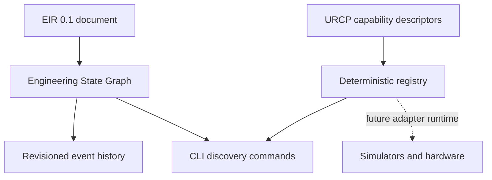

# MIRAGE Code Review

## Review scope

This review covers the ESG and URCP vertical slice added after Iteration 1. The reviewed areas are the EIR-backed Engineering State Graph, the declarative URCP capability registry, CLI inspection commands, specifications, examples, and tests.

## Architecture summary

The implementation keeps the correct separation between semantic state and execution declarations. ESG stores current project state around an EIR document, while URCP describes capabilities without executing them. This is appropriate for the current milestone because it creates testable boundaries before simulator integration.

## Important files

| File | Responsibility |
|---|---|
| `src/mirage/knowledge/esg.py` | ESG event model, revision tracking, duplicate-event protection, JSON persistence |
| `src/mirage/runtime/urcp.py` | Capability descriptor, security classification, registry, default declarations |
| `src/mirage/cli.py` | `esg-inspect` and `capabilities` commands |
| `specs/ESG/README.md` | ESG invariants and state-history boundary |
| `specs/URCP/README.md` | URCP descriptor and registry contract |
| `tests/test_esg_urcp.py` | Persistence, duplicate detection, lookup, filtering, and serialization coverage |
| `examples/03-esg-urcp/` | Demonstrable persisted state and CLI usage |

## Strengths

The ESG model is intentionally small and preserves the EIR document as the canonical semantic payload. Revision numbers and append-only events make state changes inspectable without requiring a database. Duplicate event IDs are rejected, and persisted snapshots round-trip through Pydantic validation.

The URCP registry is deterministic and declarative. It rejects duplicate capability/version pairs, requires an exact version when multiple versions exist, supports backend and security-class filtering, and returns stable ordering. The descriptor records important execution metadata including side effects, failure modes, determinism, cancellation, resource requirements, and security classification.

The CLI does not imply unsupported execution. Listing `run_simulation` declares a capability but does not claim that a simulator is installed or that a simulation has run. This boundary is documented and tested at the appropriate level.

## Risks and follow-up work

The ESG is currently an in-process snapshot model. A future persistence layer must define concurrency, transactional updates, event replay, corruption recovery, and migration. The current event model does not yet enforce that an event's EIR references exist, so future versions should add reference validation against the active document.

URCP currently registers descriptors but has no executor, policy engine, adapter lifecycle, capability negotiation, or structured execution result. Those pieces must be implemented before `run_simulation`, external side effects, or physical actuation are exposed. Security classes are descriptive at this stage and are not yet enforcement mechanisms.

The default registry includes simulator names for planning and filtering only. It must not be treated as simulator support. A simulator adapter should be added only with a concrete contract test, environment detection, deterministic fixtures where possible, and explicit limitations.

## Tests and verification

The current verification suite passes with 13 tests. Ruff passes for source, tests, and scripts. The EIR schema consistency check passes. The ESG CLI snapshot inspection and URCP backend filtering examples pass. Repository diff checks pass.

## Collaborator guidance

Keep EIR, ESG, and URCP versioned independently. Do not add simulator-specific fields to EIR or core orchestration merely to support one backend. Add a new capability descriptor before adding an executor, and add a contract test before claiming backend support. Preserve secret redaction, provenance, deterministic validation, and explicit safety boundaries.

## Recommended next slice

Implement a capability execution interface that accepts a validated descriptor and a policy context, returns a structured result, and refuses all non-read-only execution by default. Then add one simulator adapter behind that interface, starting in a controlled simulation-only environment.
