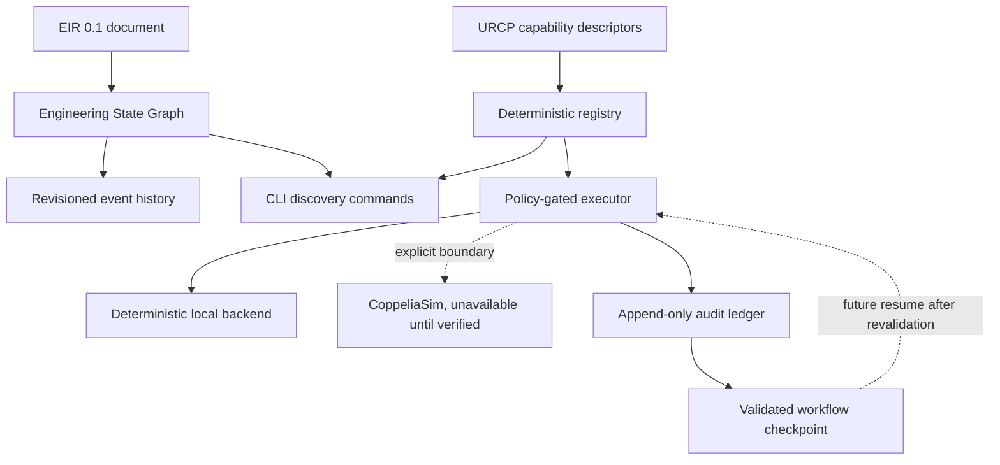

# MIRAGE Code Review

## Review scope

This review covers the ESG and URCP vertical slice, policy-gated execution, the append-only execution ledger, workflow checkpoints, backend boundaries, CLI commands, specifications, examples, and tests added through Iteration 3.

## Architecture summary

The implementation keeps the correct separation between semantic state, execution declarations, audit history, and resumable workflow state. ESG stores current project state around an EIR document, URCP describes capabilities, the executor applies policy, the ledger records attempts, and checkpoints preserve validated state without automatically resuming work.

## Important files

| File | Responsibility |
|---|---|
| `src/mirage/knowledge/esg.py` | ESG event model, revision tracking, duplicate-event protection, JSON persistence |
| `src/mirage/runtime/urcp.py` | Capability descriptor, security classification, registry, default declarations |
| `src/mirage/runtime/execution.py` | Execution policy, request/result types, executor, local backend, CoppeliaSim boundary |
| `src/mirage/runtime/ledger.py` | Append-only JSONL audit records, request IDs, redaction, persistence, and lookup |
| `src/mirage/runtime/checkpoint.py` | Validated workflow checkpoint snapshots and revisioning |
| `src/mirage/runtime/` | Public runtime exports for execution, ledger, checkpoint, and URCP APIs |
| `src/mirage/cli.py` | EIR, ESG, URCP, execution, ledger, checkpoint, and doctor commands |
| `tests/test_ledger_checkpoint.py` | Ledger persistence, redaction, execution recording, and checkpoint coverage |
| `docs/guides/execution-ledger.md` | Ledger and checkpoint semantics |
| `examples/05-ledger-checkpoint/` | Audit and checkpoint workflow example |
| `specs/URCP/README.md` | URCP execution, policy, and adapter contract |

## Strengths

The ESG model preserves the EIR document as the canonical semantic payload. Revision numbers and append-only events make state changes inspectable without requiring a database. Duplicate event IDs are rejected, and persisted snapshots round-trip through Pydantic validation.

The URCP registry is deterministic and declarative. It rejects duplicate capability/version pairs, requires an exact version when multiple versions exist, supports backend and security-class filtering, and returns stable ordering. The descriptor records execution metadata including side effects, failure modes, determinism, cancellation, resource requirements, and security classification.

The execution policy has safe defaults. Read-only operations are allowed by default, simulation requires explicit permission, and external side effects and physical actuation remain denied. The local backend is deterministic test infrastructure. The CoppeliaSim boundary explicitly reports unavailable instead of claiming unverified support.

The ledger records denied, unavailable, and successful attempts when enabled. Secret-looking keys are redacted before persistence. Checkpoints are validated snapshots and do not execute instructions on load.

## Risks and follow-up work

The ESG is currently an in-process snapshot model. A future persistence layer must define concurrency, transactional updates, event replay, corruption recovery, and migration. Event references should eventually be validated against the active EIR document.

The local ledger has no file locking, encryption, retention policy, database transactions, distributed coordination, adapter lifecycle management, capability negotiation, resource isolation, timeout cancellation, or external policy service. These are required before the ledger becomes a production control-plane component.

Checkpoint resume must revalidate the current capability registry and execution policy before any future action. Loading a checkpoint must remain non-executable by default.

The default registry includes simulator names for planning and filtering only. The CoppeliaSim boundary must not be treated as simulator support. A verified adapter should add a concrete transport, environment detection, capability coverage, deterministic fixtures where possible, resource and timeout policy, and explicit limitations.

## Tests and verification

The current verification suite passes with 19 tests. Ruff passes for source, tests, and scripts. The EIR schema consistency check passes. ESG CLI snapshot inspection, URCP backend filtering, policy denial, deterministic local execution, unavailable CoppeliaSim behavior, audit persistence, secret redaction, checkpoint round trips, ledger inspection, checkpoint inspection, secret-pattern scanning, tracked no-em-dash scanning, and repository diff checks pass.

## Collaborator guidance

Keep EIR, ESG, and URCP versioned independently. Do not add simulator-specific fields to EIR or core orchestration merely to support one backend. Add a new capability descriptor before adding an executor, and add a contract test before claiming backend support. Preserve secret redaction, provenance, deterministic validation, and explicit safety boundaries.

## Recommended next slice

Add file locking or a transactional storage backend, request-level timeout and cancellation semantics, resource limits, ledger retention and integrity policy, and stronger policy provenance. Then verify one simulator adapter, starting with project inspection and state extraction before simulation control or experiment execution.
