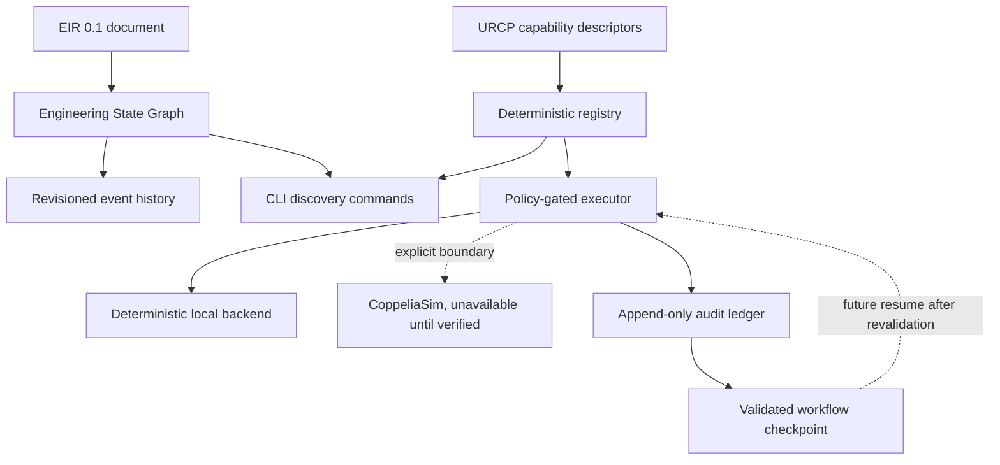

# MIRAGE Code Review

## Review scope

This review covers the ESG and URCP vertical slice, policy-gated execution, the append-only execution ledger, workflow checkpoints, backend boundaries, CLI commands, specifications, examples, and tests added through Iteration 3.

## Architecture summary



The implementation keeps the correct separation between semantic state, execution declarations, audit history, and resumable workflow state. ESG stores current project state around an EIR document, URCP describes capabilities, the executor applies policy, the ledger records attempts, and checkpoints preserve validated state without automatically resuming work.

## Important files

| File | Responsibility |
|---|---|
| `src/mirage/knowledge/esg.py` | ESG event model, revision tracking, duplicate-event protection, JSON persistence |
| `src/mirage/runtime/urcp.py` | Capability descriptor, security classification, registry, default declarations |
| `src/mirage/runtime/execution.py` | Execution policy, request/result types, executor, local backend, CoppeliaSim boundary |
| `src/mirage/runtime/ledger.py` | Append-only JSONL audit records, request IDs, redaction, persistence, and lookup |
| `src/mirage/runtime/checkpoint.py` | Validated workflow checkpoint snapshots and revisioning |
| `src/mirage/runtime/` | Public runtime exports for execution, ledger, checkpoint, and URCP APIs |
| `src/mirage/cli.py` | EIR, ESG, URCP, execution, ledger, checkpoint, and doctor commands |
| `tests/test_ledger_checkpoint.py` | Ledger persistence, redaction, execution recording, and checkpoint coverage |
| `docs/guides/execution-ledger.md` | Ledger and checkpoint semantics |
| `examples/05-ledger-checkpoint/` | Audit and checkpoint workflow example |
| `specs/URCP/README.md` | URCP execution, policy, and adapter contract |

## Strengths

The ESG model preserves the EIR document as the canonical semantic payload. Revision numbers and append-only events make state changes inspectable without requiring a database. Duplicate event IDs are rejected, and persisted snapshots round-trip through Pydantic validation.

The URCP registry is deterministic and declarative. It rejects duplicate capability/version pairs, requires an exact version when multiple versions exist, supports backend and security-class filtering, and returns stable ordering. The descriptor records execution metadata including side effects, failure modes, determinism, cancellation, resource requirements, and security classification.

The execution policy has safe defaults. Read-only operations are allowed by default, simulation requires explicit permission, and external side effects and physical actuation remain denied. The local backend is deterministic test infrastructure. The CoppeliaSim boundary explicitly reports unavailable instead of claiming unverified support.

The ledger records denied, unavailable, and successful attempts when enabled. Secret-looking keys are redacted before persistence. Checkpoints are validated snapshots and do not execute instructions on load.

## Risks and follow-up work

The ESG is currently an in-process snapshot model. A future persistence layer must define concurrency, transactional updates, event replay, corruption recovery, and migration. Event references should eventually be validated against the active EIR document.

The local ledger has no file locking, encryption, retention policy, database transactions, distributed coordination, adapter lifecycle management, capability negotiation, resource isolation, timeout cancellation, or external policy service. These are required before the ledger becomes a production control-plane component.

Checkpoint resume must revalidate the current capability registry and execution policy before any future action. Loading a checkpoint must remain non-executable by default.

The default registry includes simulator names for planning and filtering only. The CoppeliaSim boundary must not be treated as simulator support. A verified adapter should add a concrete transport, environment detection, capability coverage, deterministic fixtures where possible, resource and timeout policy, and explicit limitations.

## Tests and verification

The current verification suite passes with 19 tests. Ruff passes for source, tests, and scripts. The EIR schema consistency check passes. ESG CLI snapshot inspection, URCP backend filtering, policy denial, deterministic local execution, unavailable CoppeliaSim behavior, audit persistence, secret redaction, checkpoint round trips, ledger inspection, checkpoint inspection, secret-pattern scanning, tracked no-em-dash scanning, and repository diff checks pass.

## Collaborator guidance

Keep EIR, ESG, and URCP versioned independently. Do not add simulator-specific fields to EIR or core orchestration merely to support one backend. Add a new capability descriptor before adding an executor, and add a contract test before claiming backend support. Preserve secret redaction, provenance, deterministic validation, and explicit safety boundaries.

## Recommended next slice

Add file locking or a transactional storage backend, request-level timeout and cancellation semantics, resource limits, ledger retention and integrity policy, and stronger policy provenance. Then verify one simulator adapter, starting with project inspection and state extraction before simulation control or experiment execution.

## Distribution readiness review

The release-readiness slice keeps the Python runtime authoritative and makes the npm surface intentionally thin. The `mirage-engineering` Python distribution is configured through Hatchling with the in-package `mirage.__version__` as its version source. The current alpha version is `0.1.0a0`, which is both PEP 440 compliant and accurately signals pre-release status.

```mermaid
flowchart LR
    PYPI[mirage-engineering wheel and source archive] --> PYCLI[mirage Python CLI]
    NPM[@unstable-kernel/mirage private launcher] --> PYCLI
    PYCLI --> CORE[MIRAGE runtime]
    CORE --> EIR[EIR and validation]
    CORE --> SAFE[URCP policy-gated execution]
```

| File | Distribution responsibility |
|---|---|
| `pyproject.toml` | Registry-safe Python project identity, classifiers, URLs, dynamic version source, console script, and Hatchling wheel configuration |
| `src/mirage/__init__.py` | Installed package version and maintainer identity |
| `tests/test_distribution.py` | Validates in-package and installed distribution metadata agreement |
| `packages/npm-launcher/` | Private scoped launcher that forwards to the installed Python CLI |
| `docs/guides/distribution.md` | Package naming, artifact checks, release ownership, and non-publication boundary |
| `.github/workflows/ci.yml` | Python artifact and npm launcher checks with no publishing workflow |

The npm launcher forwards CLI arguments to the `mirage` binary or to `MIRAGE_COMMAND` for controlled environments. It correctly fails with an actionable message when the runtime is absent. It does not install Python automatically, download binaries, send telemetry, or duplicate the engineering runtime in JavaScript.

## Release-specific risks

The names `mirage-engineering` and `@unstable-kernel/mirage` were available during this build but registry availability is time-sensitive. A maintainer must check both names again immediately before publishing. No publish token, registry credential, or release automation belongs in this repository or CI until explicit release ownership and trusted-publishing configuration are approved.

The Python CI artifact job must install the built wheel in an environment that is not shadowed by the checkout when this becomes a release gate. The local verification confirms the wheel metadata and command entry point, but a future isolated environment test will provide stronger assurance. The npm launcher is deliberately marked `private: true`; changing that flag is a release decision, not a routine code change.

## Updated verification

The full suite now passes with 21 tests. Ruff, EIR schema consistency, Python source and wheel builds, `twine check`, installed-wheel metadata verification, `mirage doctor`, npm launcher forwarding tests, Node syntax checks, and `npm pack --dry-run` all passed. The build phase did not publish, reserve, or upload an artifact to any registry.

## Commit and review handoff

The distribution-readiness implementation is committed as `122b8a8` with the message `feat: prepare MIRAGE distribution artifacts`. The commit contains no co-author trailer or AI attribution. Its pull request should be reviewed as a release-preparation change only: it adds build metadata, package checks, documentation, and a private launcher, but it does not authorize or perform a PyPI or npm release.
