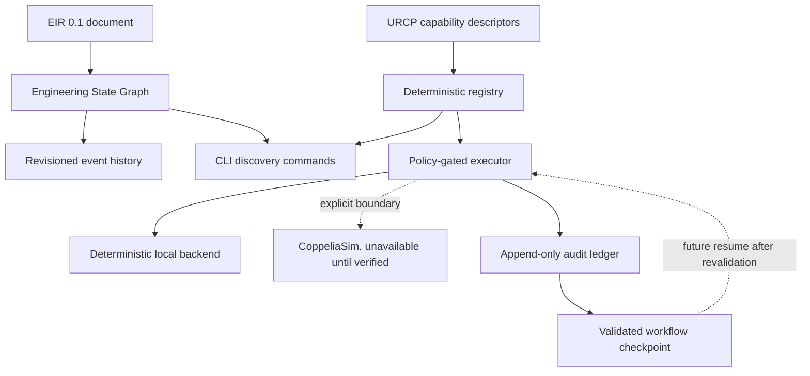
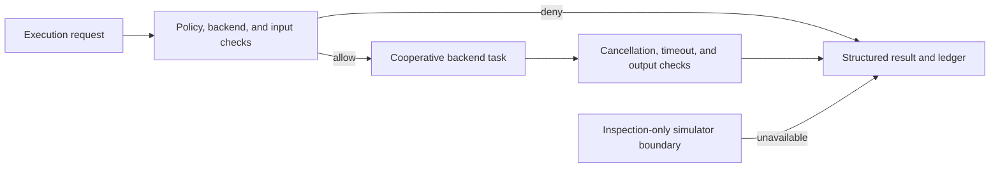
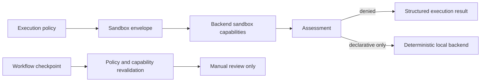

# MIRAGE Code Review

## Review scope

This review accumulates the ESG and URCP vertical slices, policy-gated execution, append-only execution ledger, workflow checkpoints, sandbox assessment, checkpoint revalidation, and read-only adapter work. Historical sections retain the implementation order; the current baseline is summarized below.

## Current baseline audit

The current baseline is [PR #10](https://github.com/Unstable-Kernel/MIRAGE/pull/10) plus the unpushed cross-artifact readiness iteration. The repository has 72 passing tests and documents an implemented EIR layer, six provider adapters with mocked contract coverage, revisioned ESG snapshots, a policy-gated execution runtime, an audit ledger, checkpoint revalidation, declarative sandbox assessment, deterministic fixture-backed read-only simulator metadata and state extraction, transport verification manifests, sandbox enforcement-evidence contracts, and EIR-bound M4 workflow, evidence, context, provenance, approval, eligibility, persistence, revocation, lifecycle, controlled context, deterministic report, cross-artifact consistency, review-policy, and readiness primitives.

| Surface | Current status | Boundary that remains explicit |
|---|---|---|
| EIR and ESG | Implemented and persisted as validated local JSON | No concurrent or transactional graph storage |
| Providers | Six explicit adapters with mocked contracts | Live integrations remain opt-in and provider dependent |
| URCP runtime | Policy-gated execution, ledger, timeout, cancellation, and resource budgets | No arbitrary host commands or unrestricted side effects |
| Sandbox and checkpoint safety | Declarative preflight and non-executing revalidation | No OS isolation or automatic resume |
| Simulator adapter | Deterministic fixture metadata and state extraction | No real transport, simulator connection, or control |
| Transport verification | Versioned manifest and fixture evidence assessment | No live CoppeliaSim verification or connection |
| Sandbox evidence | OS envelope claims require matching verified evidence | No real local cgroup, container, mount, firewall, or process isolation |
| M4 workflow foundation | Goal, bounded steps, criteria, checkpoint, and manual revalidation | No model planning, execution, evaluation, or report pipeline |
| Deterministic workflow evidence | EIR-bound steps, criterion coverage, source-node checks, and review artifacts | No engineering correctness judgment, automatic approval, or backend invocation |
| Context and review trace | Redacted references, policy provenance, required review stages, and local trace checks | No retrieval, raw artifacts, approval, execution, or checkpoint resume |
| Approval and eligibility | Digest-linked approval chain plus advisory technical prerequisite assessment | No identity verification, signature, authority, dispatch, or execution |
| Governance foundations | Persistence interface, revocation record, provenance seal, and lifecycle transition validation | No credentials, durable storage, signatures, state mutation, or execution |
| Controlled report artifacts | Schema-bound context envelopes, report citation graphs, provenance seal, and review lifecycle checks | No retrieval, generated claim, signature, publication, or execution |
| Cross-artifact readiness | Review graph consistency, local policy, and preserved external prerequisite denials | No dispatch, live transport, sandbox enforcement, or execution |
| Distribution | Local build verification for Python and private npm launcher | No PyPI or npm publication |

The remaining primary delivery streams are a real verified read-only simulator transport, a real enforced backend sandbox, the remaining M4 goal-to-evaluate pipeline, M5 cross-simulator translation, M6 research reproduction, and M7 hypothesis and optimization. `docs/guides/delivery-status.md` provides the associated evidence requirements and cross-cutting hardening backlog.

The documentation reconciliation verified every tracked Markdown file for local link targets and scanned the corpus for superseded implementation-status statements. The current full suite passes with 35 tests; Ruff, EIR schema consistency, CLI capability discovery, deterministic fixture inspection, secret scanning, no-em-dash scanning, and diff integrity checks passed. PR #8 is already merged, so the post-push review surface must be a new pull request.

## Documentation reconciliation handoff

The documentation reconciliation was committed as `3e2f56e` with the message `docs: reconcile runtime status and delivery roadmap`, pushed to `feat/iteration-1-foundation`, and submitted for review in [PR #9](https://github.com/Unstable-Kernel/MIRAGE/pull/9). The pull request contains the four unmerged execution and documentation commits, with no co-author trailer or AI attribution.

## Architecture summary



The implementation keeps the correct separation between semantic state, execution declarations, audit history, and resumable workflow state. ESG stores current project state around an EIR document, URCP describes capabilities, the executor applies policy, the ledger records attempts, and checkpoints preserve validated state without automatically resuming work.

## Important files

| File | Responsibility |
|---|---|
| `src/mirage/knowledge/esg.py` | ESG event model, revision tracking, duplicate-event protection, JSON persistence |
| `src/mirage/runtime/urcp.py` | Capability descriptor, security classification, registry, default declarations |
| `src/mirage/runtime/execution.py` | Execution policy, request/result types, executor, local backend, CoppeliaSim boundary |
| `src/mirage/runtime/ledger.py` | Append-only JSONL audit records, request IDs, redaction, persistence, and lookup |
| `src/mirage/runtime/checkpoint.py` | Validated workflow checkpoint snapshots and revisioning |
| `src/mirage/runtime/` | Public runtime exports for execution, ledger, checkpoint, and URCP APIs |
| `src/mirage/cli.py` | EIR, ESG, URCP, execution, ledger, checkpoint, and doctor commands |
| `tests/test_ledger_checkpoint.py` | Ledger persistence, redaction, execution recording, and checkpoint coverage |
| `docs/guides/execution-ledger.md` | Ledger and checkpoint semantics |
| `examples/05-ledger-checkpoint/` | Audit and checkpoint workflow example |
| `specs/URCP/README.md` | URCP execution, policy, and adapter contract |

## Strengths

The ESG model preserves the EIR document as the canonical semantic payload. Revision numbers and append-only events make state changes inspectable without requiring a database. Duplicate event IDs are rejected, and persisted snapshots round-trip through Pydantic validation.

The URCP registry is deterministic and declarative. It rejects duplicate capability/version pairs, requires an exact version when multiple versions exist, supports backend and security-class filtering, and returns stable ordering. The descriptor records execution metadata including side effects, failure modes, determinism, cancellation, resource requirements, and security classification.

The execution policy has safe defaults. Read-only operations are allowed by default, simulation requires explicit permission, and external side effects and physical actuation remain denied. The local backend is deterministic test infrastructure. The CoppeliaSim boundary explicitly reports unavailable instead of claiming unverified support.

The ledger records denied, unavailable, and successful attempts when enabled. Secret-looking keys are redacted before persistence. Checkpoints are validated snapshots and do not execute instructions on load.

## Risks and follow-up work

The ESG is currently an in-process snapshot model. A future persistence layer must define concurrency, transactional updates, event replay, corruption recovery, and migration. Event references should eventually be validated against the active EIR document.

The local ledger has no file locking, encryption, retention policy, database transactions, distributed coordination, adapter lifecycle management, capability negotiation, resource isolation, timeout cancellation, or external policy service. These are required before the ledger becomes a production control-plane component.

Checkpoint resume must revalidate the current capability registry and execution policy before any future action. Loading a checkpoint must remain non-executable by default.

The default registry includes simulator names for planning and filtering only. The CoppeliaSim boundary must not be treated as simulator support. A verified adapter should add a concrete transport, environment detection, capability coverage, deterministic fixtures where possible, resource and timeout policy, and explicit limitations.

## Tests and verification

Historical verification snapshot at this point in the implementation sequence: 19 tests passed. The current verification result is recorded in the latest review section and workflow context.

## Collaborator guidance

Keep EIR, ESG, and URCP versioned independently. Do not add simulator-specific fields to EIR or core orchestration merely to support one backend. Add a new capability descriptor before adding an executor, and add a contract test before claiming backend support. Preserve secret redaction, provenance, deterministic validation, and explicit safety boundaries.

## Historical recommended next slice, completed in later slices

Add file locking or a transactional storage backend, request-level timeout and cancellation semantics, resource limits, ledger retention and integrity policy, and stronger policy provenance. Then verify one simulator adapter, starting with project inspection and state extraction before simulation control or experiment execution.

## Distribution readiness review

The release-readiness slice keeps the Python runtime authoritative and makes the npm surface intentionally thin. The `mirage-engineering` Python distribution is configured through Hatchling with the in-package `mirage.__version__` as its version source. The current alpha version is `0.1.0a0`, which is both PEP 440 compliant and accurately signals pre-release status.

```mermaid
flowchart LR
    PYPI[mirage-engineering wheel and source archive] --> PYCLI[mirage Python CLI]
    NPM[@unstable-kernel/mirage private launcher] --> PYCLI
    PYCLI --> CORE[MIRAGE runtime]
    CORE --> EIR[EIR and validation]
    CORE --> SAFE[URCP policy-gated execution]
```

| File | Distribution responsibility |
|---|---|
| `pyproject.toml` | Registry-safe Python project identity, classifiers, URLs, dynamic version source, console script, and Hatchling wheel configuration |
| `src/mirage/__init__.py` | Installed package version and maintainer identity |
| `tests/test_distribution.py` | Validates in-package and installed distribution metadata agreement |
| `packages/npm-launcher/` | Private scoped launcher that forwards to the installed Python CLI |
| `docs/guides/distribution.md` | Package naming, artifact checks, release ownership, and non-publication boundary |
| `.github/workflows/ci.yml` | Python artifact and npm launcher checks with no publishing workflow |

The npm launcher forwards CLI arguments to the `mirage` binary or to `MIRAGE_COMMAND` for controlled environments. It correctly fails with an actionable message when the runtime is absent. It does not install Python automatically, download binaries, send telemetry, or duplicate the engineering runtime in JavaScript.

## Release-specific risks

The names `mirage-engineering` and `@unstable-kernel/mirage` were available during this build but registry availability is time-sensitive. A maintainer must check both names again immediately before publishing. No publish token, registry credential, or release automation belongs in this repository or CI until explicit release ownership and trusted-publishing configuration are approved.

The Python CI artifact job must install the built wheel in an environment that is not shadowed by the checkout when this becomes a release gate. The local verification confirms the wheel metadata and command entry point, but a future isolated environment test will provide stronger assurance. The npm launcher is deliberately marked `private: true`; changing that flag is a release decision, not a routine code change.

## Updated verification

The full suite now passes with 21 tests. Ruff, EIR schema consistency, Python source and wheel builds, `twine check`, installed-wheel metadata verification, `mirage doctor`, npm launcher forwarding tests, Node syntax checks, and `npm pack --dry-run` all passed. The build phase did not publish, reserve, or upload an artifact to any registry.

## Commit and review handoff

The distribution-readiness implementation is committed as `122b8a8` with the message `feat: prepare MIRAGE distribution artifacts`. The commit contains no co-author trailer or AI attribution. Its pull request should be reviewed as a release-preparation change only: it adds build metadata, package checks, documentation, and a private launcher, but it does not authorize or perform a PyPI or npm release.

## Execution hardening iteration review

The execution runtime now applies an explicit policy-provenance record and resource budget to every returned result. The runtime checks backend allow-lists, input size, and requested timeout before a backend receives work. It then uses a cooperative cancellation token, timeout wait, and output-size check to make policy outcomes observable rather than implicit.



| File | Hardening responsibility |
|---|---|
| `src/mirage/runtime/execution.py` | Timeout, cancellation token, input/output byte limits, policy provenance, and structured status results |
| `src/mirage/runtime/simulator_inspection.py` | Non-connecting, inspection-only CoppeliaSim boundary with no control surface |
| `src/mirage/cli.py` | `--timeout-seconds` execution option and `simulator-inspect` command |
| `tests/test_execution_hardening.py` | Preflight denial, timeout, cancellation, provenance, and inspection-boundary coverage |
| `docs/guides/execution-hardening.md` | User-facing enforcement sequence and safety limitations |
| `docs/guides/core-features.md` | Prioritized upcoming MIRAGE core-feature roadmap |

The inspection boundary is correctly conservative. It records endpoint configuration only and explicitly reports that no connection or control action occurred. It does not implement simulator state extraction, transport negotiation, project loading, scene traversal, simulation control, or actuator access.

## Hardening risks and follow-up work

Cancellation is cooperative within the current Python task model. A backend that blocks in non-cooperative native code, a subprocess, or a remote server still needs an external sandbox, process management, resource cgroup, deadline propagation, and cleanup contract. Current byte budgets are deterministic serialized-payload checks, not CPU, RAM, disk, GPU, network, or process limits.

The documented fixture-backed read-only adapter slice was completed in a later section. A real transport still requires transport verification, authorization, state semantics, timeout behavior, cleanup evidence, independent fixtures, and safety review before MIRAGE can consider any simulator control capability.

## Updated verification

The suite now passes with 26 tests. Ruff, EIR schema consistency, safe CLI inspection, explicit local execution with a timeout budget, secret-pattern scanning, tracked no-em-dash scanning, and `git diff --check` passed. No simulator connection, control operation, external side effect, physical actuation, package publication, or release upload occurred.

## Sandbox and checkpoint revalidation iteration review

The sandbox envelope implementation is deliberately declarative. A `SandboxEnvelope` describes CPU, memory, disk, process, network, filesystem, and subprocess restrictions. `BackendSandboxCapabilities` makes a backend's claimed enforcement explicit. MIRAGE compares the two before dispatch and denies work that requests operating-system-level restrictions the backend cannot enforce.



| File | Safety responsibility |
|---|---|
| `src/mirage/runtime/sandbox.py` | Declared envelope, backend enforcement claims, and conservative assessment |
| `src/mirage/runtime/execution.py` | Sandbox preflight denial and execution-result assessment metadata |
| `src/mirage/runtime/checkpoint.py` | Non-executing policy and capability revalidation for manual resume review |
| `tests/test_sandbox_checkpoint.py` | Declarative local outcome, unsupported resource denial, and checkpoint drift coverage |
| `docs/guides/sandbox-checkpoint-revalidation.md` | User-facing boundary and safe CLI behavior |

Checkpoint revalidation is correctly non-executing. It compares stored policy provenance, exact capability versions, policy permission, and explicit backend allow-lists before a checkpoint can enter a future human review flow. It never changes the checkpoint or invokes a backend.

## Sandbox-specific risks and next step

The implementation does not create an OS sandbox. The local backend has no cgroup, process supervisor, filesystem mount, network firewall, container runtime, CPU quota, memory limit, disk quota, GPU partition, subprocess interceptor, or forced cleanup. These restrictions are denied when requested instead of being represented as successful enforcement.

The fixture-backed read-only simulator metadata and state-extraction adapter was completed in a later slice. An independently verified real transport and an enforced backend sandbox remain; the latter must use a suitable isolated runtime and auditable OS-level policy enforcement design.

## Updated verification

The suite now passes with 30 tests. Ruff, EIR schema consistency, sandbox assessment CLI, denied sandbox budget CLI, checkpoint revalidation CLI for both denied and explicitly allowed cases, secret-pattern scanning, tracked no-em-dash scanning, and diff integrity checks passed. No checkpoint was resumed, no process isolation was claimed, and no simulator connection or control operation occurred.

## Read-only simulator adapter iteration review

`src/mirage/runtime/simulator_adapter.py` introduces a deliberately narrow protocol. The only public adapter operations are `read_project_metadata()` and `read_state_snapshot()`. The models describe static project metadata and bounded object observations. They contain no instruction, command, write, start, stop, reset, or step field.

| File | Review outcome |
|---|---|
| `src/mirage/runtime/simulator_adapter.py` | Fixture reads are deterministic and deep-copied; all results include a sandbox assessment and force `control_available` to false |
| `src/mirage/runtime/urcp.py` | `inspect_simulator_state@0.1` is classified as read-only and declares its adapter requirement |
| `src/mirage/cli.py` | `simulator-metadata` accepts a fixture path and optional state output, with no simulator control flags |
| `tests/test_simulator_adapter.py` | Covers deterministic reads, policy and sandbox denial, timeout cancellation, unavailable CoppeliaSim behavior, and CLI output |
| `examples/07-simulator-adapter/` | Provides a deterministic state-extraction fixture rather than a live or control-capable simulation |

The adapter correctly treats CoppeliaSim as unavailable. Supplying an endpoint is evidence only that a configuration string exists. No socket, RPC call, simulator command, state mutation, or physical action is performed. The fixture backend is marked as transport verified only in the narrow sense that the local fixture read contract is deterministic and tested. It must not be interpreted as verification of a real simulator transport.

Timeout handling follows the existing cooperative `CancellationToken` pattern. This protects the in-process task boundary but does not form an OS sandbox or guarantee interruption of a future non-cooperative external transport. The next real adapter must retain this typed result model while adding adapter-specific transport verification, snapshot consistency semantics, authentication boundaries, independent fixtures, and a separate safety review.

## Updated verification

The complete repository suite passes with 35 tests. Ruff, EIR schema consistency, fixture CLI inspection, unavailable CoppeliaSim CLI behavior, secret-pattern scanning, tracked no-em-dash scanning, and diff integrity checks passed. No simulator connection, control command, physical actuation, external side effect, package publication, or branch push occurred in this iteration.

## Parallel foundation iteration review

The transport, sandbox, and workflow work packages were implemented independently and joined only at typed policy and review boundaries. This avoids treating a fixture contract as live transport, a static capability claim as host isolation, or a proposed workflow as permission to execute it.

| File | Review outcome |
|---|---|
| `src/mirage/runtime/transport_verification.py` | Transport manifests require a complete prohibited-control set; evidence must cover every declared read operation before an assessment becomes valid |
| `src/mirage/runtime/sandbox.py` | Requested OS-level envelopes now require matching capabilities and verified enforcement evidence; missing or partial evidence is denied |
| `src/mirage/runtime/goal_workflow.py` | M4 foundation is bounded to review-only goal, steps, criteria, checkpoint, and revalidation contracts with `execution_permitted` fixed to false |
| `src/mirage/runtime/simulator_adapter.py` | Unavailable CoppeliaSim results now identify the unverified ZeroMQ reference manifest without connecting |
| `src/mirage/cli.py` | `transport-assess` and `goal-workflow-review` parse local JSON and return structured non-executing evidence |
| `examples/08-parallel-foundations/` | Provides deterministic manifest, evidence, and workflow fixtures that do not rely on a simulator service |

The CoppeliaSim ZeroMQ API is intentionally not treated as intrinsically read-only because the official API surface includes simulator control. The reference manifest therefore captures protocol vocabulary and prohibited control operations only. It does not import a CoppeliaSim client, open a socket, or report live verification.

Sandbox enforcement evidence is deliberately a claim-validation contract. The evidence-backed local test backend proves the executor acceptance condition, not operating-system isolation. No cgroup, container, mount namespace, network firewall, process supervisor, resource quota, or cleanup daemon was installed or invoked.

The M4 review model remains human-gated. It can reject unavailable or policy-denied capabilities through existing checkpoint revalidation, but it cannot invoke a provider, execute a capability, resume a checkpoint, collect evidence, or generate an engineering report. This is the correct safety boundary while real transport and enforced sandbox work remain incomplete.

## Parallel iteration verification

The full suite passes with 45 tests. Ruff, EIR schema consistency, Markdown local-link checks, capability discovery, deterministic transport assessment, goal-workflow review, unavailable CoppeliaSim CLI behavior, secret scanning, tracked no-em-dash scanning, and diff integrity checks passed. No simulator connection, control command, external side effect, physical actuation, checkpoint resume, OS-level isolation, package publication, or branch push occurred during this iteration.

The parallel foundation implementation is committed locally as `44b6a3b` with the message `feat: add parallel safety foundations`. It contains no co-author trailer or AI attribution. The commit is intentionally not pushed because the user has not requested a branch update for this iteration.

## Deterministic workflow and verification-integrity review

`workflow_evidence.py` separates deterministic reference validation from engineering judgment. It first confirms that a workflow identifies the supplied EIR document and that every step cites known EIR nodes. It then assesses whether declared evidence covers each required criterion from a source node included in the plan. Both artifacts retain `execution_permitted: false`.

| File | Review outcome |
|---|---|
| `src/mirage/runtime/workflow_evidence.py` | EIR-to-plan and evidence assessment are deterministic, typed, and non-executing |
| `src/mirage/runtime/goal_workflow.py` | Each review step now requires declared source-node identifiers |
| `src/mirage/runtime/transport_verification.py` | Live verification cannot be represented without authorization, version, verifier, transcript digest, and cleanup evidence |
| `src/mirage/runtime/sandbox.py` | Verified evidence cannot be represented without digest, environment fingerprint, verifier, and controls |
| `src/mirage/cli.py` | Planning and evidence commands parse local files only and never call a provider or backend |
| `examples/09-deterministic-workflow/` | Canonical EIR-bound plan and evidence fixture for manual review |

The integrity fields are admission requirements for a future verified claim, not fabricated evidence. No live simulator transport, actual sandbox enforcement, model call, capability execution, report generation, external side effect, physical actuation, or automatic approval has been added.

## Deterministic workflow verification

The full suite passes with 53 tests. Ruff, EIR schema consistency, Markdown local-link checks, EIR-bound planning and evidence CLI inspection, capability discovery, secret scanning, tracked no-em-dash scanning, and diff integrity checks passed. The iteration is ready for a local commit and remains unpushed.

The deterministic workflow and verification-integrity implementation is committed locally as `3a3a819` with the message `feat: add deterministic workflow evidence review`. It contains no co-author trailer or AI attribution and remains unpushed pending an explicit user request.

## Context and review-trace iteration review

The context and trace contracts complete another locally verifiable M4 foundation. A context bundle is restricted to identifiers, redacted references, digests, source-node bindings, and observations. A review trace is restricted to reference and digest records for four required stages. Both are validated against the workflow, plan, evidence status, and active policy provenance.

| File | Review outcome |
|---|---|
| `src/mirage/runtime/context_review.py` | Context bundle validation rejects workflow, EIR, policy, and source-node drift without retrieving data |
| `src/mirage/runtime/review_trace.py` | Trace assessment requires context, plan, evidence, and human-review stages while preserving `execution_permitted: false` |
| `src/mirage/cli.py` | Context and trace commands parse local artifacts only and do not mutate workflow state |
| `examples/10-context-review/` | Provides a redacted fixture context and complete provenance trace for deterministic inspection |
| `tests/test_context_review.py` and `tests/test_review_trace.py` | Cover ready and invalid outcomes for source binding and policy-provenance drift |

No arbitrary content ingestion, URI retrieval, prompt construction, model invocation, capability execution, checkpoint resume, human approval mutation, simulator transport, sandbox enforcement, external side effect, or physical actuation was introduced. The context model is deliberately an integrity boundary, not a general retrieval or autonomous-agent subsystem.

## Context iteration verification

The full suite passes with 59 tests. Ruff, EIR schema consistency, Markdown local-link checks, local context and trace CLI inspection, generic capability discovery, secret scanning, tracked no-em-dash scanning, and diff integrity checks passed. The iteration is ready for a local commit and remains unpushed.

The context and review-trace implementation is committed locally as `f9f0ab0` with the message `feat: add workflow context review traces`. It contains no co-author trailer or AI attribution and remains unpushed pending an explicit user request.

## Guarded approval and eligibility iteration review

Approval and dispatch eligibility are now separated. An approval chain can be structurally `review_ready`, but eligibility remains ineligible unless the active policy permits simulation, transport evidence is independently live-verified, and sandbox assessment is allowed in an enforced verified environment. This separation prevents a locally stored approval fixture from becoming an execution authority.

| File | Review outcome |
|---|---|
| `src/mirage/runtime/approval_review.py` | Digest-linked, policy-bound human approval records with approved, rejected, and invalid review outcomes |
| `src/mirage/runtime/dispatch_eligibility.py` | Advisory prerequisite assessment that never dispatches and always sets `execution_permitted` to false |
| `src/mirage/cli.py` | Local approval and eligibility inspection commands that emit structured results before a deliberate ineligible exit |
| `examples/11-guarded-approval/` | Approved local fixture paired with fixture-only transport and declarative sandbox inputs that must remain ineligible |
| `tests/test_approval_review.py` and `tests/test_dispatch_eligibility.py` | Cover approval, rejection, and blocked eligibility paths |

No identity provider, signature verifier, durable audit store, notification system, approval mutation, transport client, sandbox runtime, dispatcher, simulator connection, external side effect, physical actuation, or automatic workflow resume was introduced. The ineligible example proves the intended refusal behavior.

## Guarded approval verification

The full suite passes with 64 tests. Ruff, EIR schema consistency, Markdown local-link checks, approval-chain inspection, expected ineligible dispatch eligibility output, generic capability discovery, secret scanning, tracked no-em-dash scanning, and diff integrity checks passed. The iteration is ready for a local commit and remains unpushed.

The guarded approval and advisory eligibility implementation is committed locally as `fc796df` with the message `feat: add guarded approval eligibility`. It contains no co-author trailer or AI attribution and remains unpushed pending an explicit user request.

The accumulated delivery is now pushed through `b024f18`. [PR #10](https://github.com/Unstable-Kernel/MIRAGE/pull/10) is open against `main`; it replaces PR #9, which was already merged before these later guarded workflow iterations were delivered.

## Governance foundation iteration review

The governance foundation extends the review model without adding a real authority path. The persistence descriptor contains references to future identity, signature, retention, and audit controls but holds no secret material. The persistence protocol declares only metadata and assessment methods. It does not include a write operation or a connection implementation.

| File | Review outcome |
|---|---|
| `src/mirage/runtime/approval_persistence.py` | Future persistence adapter boundary uses credential references and integrity metadata only; no credentials or writes |
| `src/mirage/runtime/revocation_review.py` | Declared revocations are structurally assessed without mutating an approval chain |
| `src/mirage/runtime/evidence_provenance.py` | Every evidence reference needs a matching local provenance seal; assessment never retrieves evidence contents |
| `src/mirage/runtime/lifecycle_review.py` | Lifecycle ordering is validated against approval and provenance readiness without saving state |
| `src/mirage/runtime/dispatch_eligibility.py` | Declared revocation becomes an additional structured reason to block future eligibility |
| `examples/12-governance-foundations/` | Local fixtures demonstrate readiness and declared review outcomes only |

The contracts cannot be mistaken for production governance: no identity provider is queried, credential is resolved, signature is checked, durable audit record is stored, revocation is applied, external system is notified, evidence is retrieved, workflow state is changed, or backend is dispatched. `execution_permitted` remains false on every new result type.

## Governance verification

The full suite passes with 68 tests. Ruff, EIR schema consistency, Markdown local-link checks, four governance CLI assessments, generic capability discovery, secret scanning, tracked no-em-dash scanning, and diff integrity checks passed. The iteration is ready for a local commit and remains unpushed.

The active-session governance foundation is committed locally as `15b9033` with the message `feat: add governance foundation contracts`. It contains no co-author trailer or AI attribution and remains unpushed pending an explicit user request.

## Controlled context and deterministic report iteration review

The controlled context model narrows a redacted bundle into one declared claim per required schema field. It compares only identifiers, kinds, reference prefixes, and digests. This prevents a report artifact from silently referencing arbitrary or out-of-schema inputs while deliberately avoiding any content retrieval or model-prompt construction.

| File | Review outcome |
|---|---|
| `src/mirage/runtime/controlled_context.py` | Schema, envelope, and local claim assessment restrict context references without exposing raw content |
| `src/mirage/runtime/deterministic_report.py` | Report sections cite only known context claims and sealed evidence; no engineering prose is generated |
| `src/mirage/runtime/report_provenance.py` | Report provenance validates identifiers and declared digest references without signing or storing data |
| `src/mirage/runtime/report_lifecycle.py` | Report lifecycle order is validated without state mutation, publication, or dispatch |
| `examples/13-controlled-report/` | Canonical local schema, envelope, report, seal, and lifecycle fixtures |

The report artifact remains a review graph, not a technical conclusion. No external artifact is fetched, credential resolved, prompt composed, model called, report rendered, signature generated, report stored, report published, workflow state changed, backend dispatched, simulator connected, or hardware actuated. Every new result retains `execution_permitted: false`.

## Controlled report verification

The full suite passes with 70 tests. Ruff, EIR schema consistency, Markdown local-link checks, four controlled context and report CLI assessments, generic capability discovery, secret scanning, tracked no-em-dash scanning, and diff integrity checks passed. The iteration is ready for a local commit and remains unpushed.

The controlled context and deterministic report implementation is committed locally as `e16d575` with the message `feat: add controlled report artifacts`. It contains no co-author trailer or AI attribution and remains unpushed pending an explicit user request.

## Cross-artifact readiness iteration review

The readiness layer is intentionally a convergence point for the review graph, not a control-plane escalation. It requires context, trace, approval, report, and report-provenance artifacts to agree on one workflow before applying bounded local report policy. It then retains advisory dispatch denials rather than converting a consistent graph into execution permission.

| File | Review outcome |
|---|---|
| `src/mirage/runtime/cross_artifact_review.py` | Validates shared workflow identity and readiness of local review artifacts without mutation |
| `src/mirage/runtime/review_policy.py` | Applies local section and citation constraints without generated engineering content |
| `src/mirage/runtime/workflow_readiness.py` | Aggregates review readiness with advisory external denial reasons while keeping execution disabled |
| `examples/14-cross-artifact-readiness/` | Canonical local policy fixture and expected external-prerequisite readiness example |
| `tests/test_cross_artifact_readiness.py` and `tests/test_cross_artifact_cli.py` | Cover consistent review graph, local policy success, readiness output, and disabled execution |

The final readiness outcome, `ready_for_external_prerequisites`, is not a dispatch-ready outcome. It explicitly preserves the missing verified live read-only transport and real enforced sandbox. The implementation adds no client, credential, storage, external action, sandbox runtime, simulator connection, model call, workflow mutation, or physical actuation.

## Cross-artifact readiness verification

The full suite passes with 72 tests. Ruff, EIR schema consistency, Markdown local-link checks, cross-artifact, review-policy, and readiness CLI inspection, generic capability discovery, secret scanning, tracked no-em-dash scanning, and diff integrity checks passed. The iteration is ready for a local commit. Further safe progress on the M4 execution path is now blocked by independently verified external transport and sandbox prerequisites.

The cross-artifact readiness implementation is committed locally as `d14b7dc` with the message `feat: add cross artifact readiness`. It contains no co-author trailer or AI attribution and remains unpushed pending an explicit user request.

## Scheduled autonomous review handoff

The repository now has one active recurring build review, titled `Every 3 hours MIRAGE build review`. It runs every 10,800 seconds, equivalent to every three hours, in `Asia/Calcutta`. The schedule status confirms the interval trigger is active. The scheduled task inherits the current task context and includes GitHub and browser access already associated with the task.

The schedule is constrained to locally verifiable MIRAGE work. At each run, it must inspect the repository state, workflow context, todo list, code review, roadmap, and PR state before selecting the next coherent slice. Only deterministic review, validation, provenance, documentation, and contract work without external credentials or infrastructure is allowed. It must keep simulator control, physical actuation, external side effects, live transport, OS-level sandbox claims, retrieval, credential handling, durable authority mutation, package publication, and branch push disabled. Every completed safe slice must include tests, examples, documentation, code review, workflow context, todo updates, full verification, and focused local commits without co-author attribution. If a slice requires an authorized live simulator environment or a real OS-enforced sandbox, it must stop and report the exact prerequisite. The policy was reverified once more while PR #10 is merged, with the branch remaining local-only and ahead of its remote. It has been verified active after project deployment, and it must not push or publish without explicit user approval.

## Ledger integrity and retention iteration review

The ledger slice adds a local JSONL integrity boundary without changing execution authority. `ExecutionLedger` now writes a versioned envelope for every record, chains canonical SHA-256 digests, takes local POSIX advisory locks for reads and writes, and refuses appends or retention compaction when the current file does not verify. The `ledger-verify` command exposes a non-executing integrity assessment, while `retain(max_records)` keeps the newest bounded set and records the digest immediately before the discarded prefix in a retention anchor.

| File | Review outcome |
|---|---|
| `src/mirage/runtime/ledger.py` | Versioned local envelope, chained digest calculation, advisory locking, malformed-file assessment, append refusal, and atomic retention compaction |
| `src/mirage/cli.py` | Read-only `ledger-verify` command that reports integrity without repairing or executing records |
| `tests/test_ledger_integrity.py` | Covers valid chains, tampering, malformed JSON, append refusal, retention anchors, locking, CLI inspection, and the canonical fixture |
| `examples/15-ledger-integrity/` | Provides a retained two-record local fixture and a verification command |
| `docs/guides/execution-ledger.md` | Documents the envelope, retention semantics, and explicit non-goals |

The guarantee is deliberately narrow. The chain detects accidental or unsophisticated local modification but does not add signatures, remote witnessing, trusted timestamps, encryption, a database transaction, storage migration, distributed coordination, or hostile-writer protection. The advisory lock is a local POSIX coordination mechanism, not a multi-host safety boundary. No simulator connection, sandbox runtime, credential handling, durable authority mutation, external side effect, physical actuation, package publication, or branch push was introduced.

The full repository suite passes with 78 tests. Ruff, EIR schema consistency, local Markdown link checks, secret-pattern scanning, tracked no-em-dash scanning, and diff integrity checks passed. The iteration is committed locally as `c6cc0ff` with the message `feat: add ledger integrity retention`; the commit contains no co-author trailer or AI attribution. [PR #10](https://github.com/Unstable-Kernel/MIRAGE/pull/10) is merged, and this ledger iteration remains unpushed pending an explicit user request.

## Local EIR ingestion iteration review

The local EIR ingestion slice introduces a bounded compiler frontend without implying general artifact extraction. `ingest_eir_file()` accepts only local UTF-8 JSON and YAML candidates, derives a source format, byte count, and SHA-256 digest, and delegates semantic acceptance entirely to the canonical EIR validator. The result keeps local source metadata separate from the input EIR document, so document, node, and relationship provenance are preserved rather than rewritten.

| File | Review outcome |
|---|---|
| `src/mirage/eir/ingestion.py` | Deterministic local read, supported-format gate, source digest, allowed-root check, parse diagnostics, and canonical validation handoff |
| `src/mirage/eir/__init__.py` | Exposes the ingestion contract through the public EIR API |
| `src/mirage/cli.py` | Adds `eir-ingest`, a non-executing local inspection command with an optional allowed root |
| `tests/test_eir_ingestion.py` | Covers JSON and YAML acceptance, preserved provenance, source digests, rejected formats, invalid syntax, mapping shape, canonical validation errors, path boundaries, and CLI behavior |
| `examples/16-eir-ingestion/` | Provides a static local JSON EIR candidate and safe command example |
| `docs/guides/eir-ingestion.md` | Defines local-only inputs, source metadata, diagnostics, and explicit non-goals |

The adapter does not fetch URIs, parse repositories, papers, URDF, MATLAB, CAD, or arbitrary formats, execute source content, invoke a provider, mutate provenance, persist data, lower an EIR artifact, or dispatch a capability. The allowed-root option is a deterministic path-boundary check, not a filesystem sandbox or hostile-writer defense.

The full repository suite passes with 85 tests. Ruff, EIR schema consistency, accepted CLI paths with and without an allowed root, local Markdown link checks, secret-pattern scanning, tracked no-em-dash scanning, and diff integrity checks passed. The iteration is committed locally as `a4ea637` with the message `feat: add local EIR ingestion adapter`; the commit contains no co-author trailer or AI attribution. The local EIR ingestion iteration remains unpushed pending an explicit user request.

## Coordinated provenance consistency iteration review

The provenance consistency slice adds a deterministic reference-only assessment across a supplied local EIR source, evidence provenance seals, and report provenance bindings. `ProvenanceConsistencyManifest` records the expected EIR document identity, local source reference and digest, plus one evidence-to-report binding per evidence identifier. `assess_provenance_consistency()` compares those supplied declarations to local ingestion metadata, seals, the deterministic report, and prior review assessments.

| File | Review outcome |
|---|---|
| `src/mirage/runtime/provenance_consistency.py` | Defines manifest, evidence-to-report binding, consistent or invalid status, explicit rejection reasons, and a permanently false execution permission |
| `src/mirage/runtime/deterministic_report.py` | Adds structured report provenance references without changing report generation or report-lifecycle authority |
| `src/mirage/cli.py` | Adds `provenance-consistency-assess`, which accepts only explicitly supplied local files and reports JSON |
| `tests/test_provenance_consistency.py` | Covers aligned artifacts, EIR digest mismatch, missing report references, and read-only CLI assessment |
| `examples/17-provenance-consistency/` | Provides a complete local manifest, evidence seals, readiness records, and report binding fixture |
| `docs/guides/provenance-consistency.md` | Documents comparison semantics, rejection reasons, and explicit non-goals |

The assessment compares the EIR digest against metadata returned by explicit local ingestion. It compares evidence and report digest declarations as strings only. It does not retrieve evidence, open a sealed reference, recalculate evidence contents, verify a signature, produce a trusted timestamp, use a remote witness, authenticate a reviewer, mutate a report, persist data, invoke a backend, or authorize execution. The report provenance reference field is a schema addition for inspection only and does not generate, sign, or publish any report content.

The coordinated ten-phase flow completed local inspection, boundary mapping, contract definition, test planning, implementation, CLI exposure, fixtures, documentation, handoff reconciliation, and full quality validation. The final suite passed with 89 tests. Ruff, EIR schema consistency, the accepted provenance-consistency CLI fixture, local Markdown links, secret-pattern scanning, tracked no-em-dash scanning, and diff integrity checks all passed. The iteration is committed locally as `9dcdb8a` with the message `feat: add provenance consistency assessment`; the commit contains no co-author trailer or AI attribution and remains unpushed.

## Coordinated report seal consistency iteration review

The report seal consistency slice adds a reference-only comparison among a supplied deterministic report, report provenance seal, report-provenance readiness result, review trace, trace readiness result, and consistency manifest. It checks report identity, workflow identity, trace identity, declared report digest, sealer reference, and the report's declared trace artifact reference. The assessment returns structured issues and has a permanently false execution permission.

| File | Review outcome |
|---|---|
| `src/mirage/runtime/report_seal_consistency.py` | Defines manifest and assessment contracts for supplied report, seal, trace, and readiness declarations |
| `src/mirage/cli.py` | Adds `report-seal-consistency-assess`, which reads only explicitly supplied local files and emits JSON |
| `tests/test_report_seal_consistency.py` | Covers aligned declarations, a report-digest mismatch, missing report trace reference, and CLI behavior |
| `examples/18-report-seal-consistency/` | Provides report, seal, readiness, trace, and manifest fixture declarations |
| `docs/guides/report-seal-consistency.md` | Documents local comparison semantics, rejection reasons, and explicit non-goals |

The report digest and sealer reference are compared as declared strings only. The assessment does not recompute a report digest, inspect source content, verify a signature, authenticate a sealer, create a trusted timestamp, contact a remote witness, store a seal, mutate lifecycle state, publish a report, invoke a backend, or authorize execution.

The coordinated ten-phase flow completed local inspection, contract mapping, invariant definition, test planning, implementation, API and CLI exposure, fixtures, documentation, handoff reconciliation, and full validation. The final suite passed with 93 tests. Ruff, EIR schema consistency, the accepted report-seal consistency CLI fixture, local Markdown links, secret-pattern scanning, tracked no-em-dash scanning, and diff integrity checks all passed. The iteration is committed locally as `05813dc` with the message `feat: add report seal consistency`; the commit contains no co-author trailer or AI attribution and remains unpushed.

## Review-trace event consistency iteration review

The review-trace event consistency slice adds a deterministic, reference-only comparison across a supplied review trace, trace readiness assessment, and manifest. It validates trace, workflow, context-bundle, and policy-provenance identifiers, then validates the declared artifact reference and digest for every required review event. The result contains structured issues, records matching event types, and has a permanently false execution permission.

| File | Review outcome |
|---|---|
| `src/mirage/runtime/review_trace_consistency.py` | Defines manifest, expected event, and consistency assessment contracts for supplied local trace declarations |
| `src/mirage/cli.py` | Adds `review-trace-event-consistency-assess`, which reads only explicitly supplied local files and emits JSON |
| `tests/test_review_trace_event_consistency.py` | Covers aligned declarations, declared digest mismatch, policy-provenance mismatch, and CLI behavior |
| `examples/19-review-trace-event-consistency/` | Provides trace, readiness, and manifest fixture declarations for all four event types |
| `docs/guides/review-trace-event-consistency.md` | Documents local comparison semantics, rejection reasons, and explicit non-goals |

The assessment compares supplied strings and structured declarations only. It does not retrieve an artifact, recompute a digest, validate a signature, authenticate a reviewer, create a trusted timestamp, contact a remote witness, mutate workflow state, persist data, publish a report, invoke a backend, dispatch a capability, or authorize execution.

The full repository suite passes with 97 tests. Ruff, EIR schema consistency, the accepted review-trace event consistency CLI fixture, local Markdown links, secret-pattern scanning, tracked no-em-dash scanning, and diff integrity checks passed. The iteration is committed locally as `42e6db7` with the message `feat: add review trace event consistency`; the commit contains no co-author trailer or AI attribution and remains unpushed.

## Policy-provenance consistency iteration review

The policy-provenance consistency slice adds a deterministic, reference-only comparison across a supplied active execution policy, context bundle, context envelope, review trace, deterministic report, review policy, review-policy assessment, and manifest. It verifies policy provenance equality, expected identity declarations, and shared workflow identity. The result contains structured issues, records matching declarations, and has a permanently false execution permission.

| File | Review outcome |
|---|---|
| `src/mirage/runtime/policy_provenance_consistency.py` | Defines manifest and consistency assessment contracts for supplied local policy-bearing declarations |
| `src/mirage/cli.py` | Adds `policy-provenance-consistency-assess`, which reads only explicitly supplied local files and emits JSON |
| `tests/test_policy_provenance_consistency.py` | Covers aligned declarations, trace provenance drift, report workflow drift, and CLI behavior |
| `examples/20-policy-provenance-consistency/` | Provides policy, context, trace, report, review-policy, readiness, and manifest fixture declarations |
| `docs/guides/policy-provenance-consistency.md` | Documents local comparison semantics, rejection reasons, and explicit non-goals |

The assessment compares supplied strings and structured declarations only. It does not retrieve content, recompute a digest, validate a signature, authenticate a reviewer, create a trusted timestamp, contact a remote witness, mutate workflow state, persist data, publish a report, invoke a backend, dispatch a capability, or authorize execution.

The full repository suite passes with 101 tests. Ruff, EIR schema consistency, the accepted policy-provenance consistency CLI fixture, local Markdown links, secret-pattern scanning, tracked no-em-dash scanning, and diff integrity checks passed. The iteration is committed locally as `94e308d` with the message `feat: add policy provenance consistency`; the commit contains no co-author trailer or AI attribution and remains unpushed.

## Review-policy evidence-reference consistency iteration review

The review-policy evidence-reference consistency slice adds a deterministic, reference-only comparison across supplied review-policy bounds, review-policy readiness, deterministic report declarations, report readiness, evidence-provenance readiness, seals, and manifest bindings. It verifies policy bounds, workflow identity, evidence seal coverage, source reference and digest declarations, report evidence citation, and report provenance-reference placement. The result contains structured issues, records validated evidence identifiers, and has a permanently false execution permission.

| File | Review outcome |
|---|---|
| `src/mirage/runtime/review_policy_evidence_consistency.py` | Defines manifest, evidence binding, and consistency assessment contracts for supplied local review-policy and evidence declarations |
| `src/mirage/cli.py` | Adds `review-policy-evidence-consistency-assess`, which reads only explicitly supplied local files and emits JSON |
| `tests/test_review_policy_evidence_consistency.py` | Covers aligned declarations, policy-bound drift, missing report provenance reference, and CLI behavior |
| `examples/21-review-policy-evidence-reference-consistency/` | Provides review-policy, report, evidence-provenance, seal, and manifest fixture declarations |
| `docs/guides/review-policy-evidence-consistency.md` | Documents local comparison semantics, rejection reasons, and explicit non-goals |

The assessment compares supplied strings and structured declarations only. It does not retrieve evidence, open a source reference, recompute a digest, validate a signature, authenticate a reviewer, create a trusted timestamp, contact a remote witness, mutate workflow state, persist data, publish a report, invoke a backend, dispatch a capability, or authorize execution.

The full repository suite passes with 105 tests. Ruff, EIR schema consistency, the accepted review-policy evidence-reference CLI fixture, local Markdown links, secret-pattern scanning, repository-wide no-em-dash scanning, and diff integrity checks passed. The implementation is committed locally as `89ddba6` with the message `feat: add review policy evidence reference consistency`; the commit contains no co-author trailer or AI attribution and remains unpushed.

## Evidence-capture declaration consistency iteration review

The evidence-capture declaration consistency slice adds a deterministic, reference-only comparison across supplied capture declarations, evidence-provenance readiness, prior review-policy evidence assessment, deterministic report references, and provenance seals. It verifies workflow identity, manifest identity, sealed and review-policy-validated evidence declarations, source reference and digest declarations, capture method, capture timestamp, verifier reference, report section placement, and report provenance-reference placement. The result contains structured issues, records validated capture identifiers, and has a permanently false execution permission.

| File | Review outcome |
|---|---|
| `src/mirage/runtime/evidence_capture_consistency.py` | Defines capture declarations, manifest, assessment, and supplied-reference consistency validation |
| `src/mirage/cli.py` | Adds `evidence-capture-consistency-assess`, which reads only explicitly supplied local files and emits JSON |
| `tests/test_evidence_capture_consistency.py` | Covers aligned declarations, seal metadata drift, missing report provenance reference, and CLI behavior |
| `examples/22-evidence-capture-consistency/` | Provides capture, evidence-provenance, review-policy evidence, report, seal, and manifest fixture declarations |
| `docs/guides/evidence-capture-consistency.md` | Documents local comparison semantics, rejection reasons, and explicit non-goals |

The assessment compares supplied strings, timestamps, and structured declarations only. It does not retrieve evidence, invoke a capture method, open a source reference, recompute a digest, validate a signature, authenticate a reviewer, create a trusted timestamp, contact a remote witness, mutate workflow state, persist data, publish a report, invoke a backend, dispatch a capability, or authorize execution.

The full repository suite passes with 109 tests. Ruff, EIR schema consistency, the accepted evidence-capture CLI fixture, local Markdown links, secret-pattern scanning, repository-wide no-em-dash scanning, and diff integrity checks passed. The implementation is committed locally as `6ecda8d` with the message `feat: add evidence capture consistency`; the commit contains no co-author trailer or AI attribution and remains unpushed.
