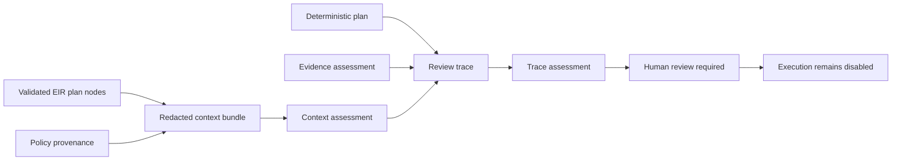

# Context Bundles and Review Traces

## Purpose

This slice adds a local, deterministic context boundary and provenance trace to the review-only M4 workflow foundation. A context bundle lists redacted references and digests. A review trace records that context, plan, evidence, and human-review artifacts have been assembled. Neither type retrieves content, exposes raw artifacts, approves work, or runs a workflow.



| Artifact | Contains | Validates | Does not contain or do |
|---|---|---|---|
| `WorkflowContextBundle` | Workflow and EIR identifiers, policy provenance, reference strings, digests, source nodes, and observations | Item uniqueness, redaction flag, plan source nodes, EIR identity, and policy provenance | Raw artifacts, external retrieval, model prompts, credentials, or backend calls |
| `WorkflowReviewTrace` | Context identifier, policy provenance, and four typed review events | Event completeness, workflow and context identity, policy provenance, context readiness, and evidence readiness | Approval, execution, checkpoint resume, report generation, or state mutation |

## Context bundle assessment

Every context item has a stable ID, a kind, a reference, a digest, and optional planned source-node references. The bundle must declare redaction verification. `assess_workflow_context()` rejects workflow, EIR, policy, or source-node drift rather than silently accepting a broader context than the deterministic plan supports.

```bash
PYTHONPATH=src mirage workflow-context-inspect \
  examples/09-deterministic-workflow/workflow.json \
  examples/01-validate-eir/robot_model.yaml \
  examples/10-context-review/context.json
```

The command only parses local files. It does not dereference a URI, fetch a document, call a provider, or access a simulator.

## Review trace assessment

A trace requires exactly the workflow review stages represented by `context_bound`, `plan_validated`, `evidence_assessed`, and `human_review_requested`. Each event carries a reference and digest. The typed trace makes review inputs inspectable without treating them as an authorization token.

```bash
PYTHONPATH=src mirage review-trace-assess \
  examples/09-deterministic-workflow/workflow.json \
  examples/01-validate-eir/robot_model.yaml \
  examples/10-context-review/context.json \
  examples/09-deterministic-workflow/evidence.json \
  examples/10-context-review/review-trace.json
```

> A `ready_for_review` trace means that local identifiers, provenance, and declared review stages are consistent. It does not mean that a reviewer approved a design, that evidence is physically valid, or that any action may be executed.

## Safety boundary

Both assessment results set `execution_permitted` to `false`. The two associated URCP declarations, `inspect_workflow_context@0.1` and `assess_review_trace@0.1`, are read-only. They exist to structure a future human review process, not to create an autonomous agent, an experiment scheduler, or a simulator-control path.

The next M4 work can add controlled context schemas and audited human approval transitions. It must not retrieve external context, expose secrets, execute a capability, or permit a resume action until a verified real read-only simulator transport and an enforced sandbox are independently available.
