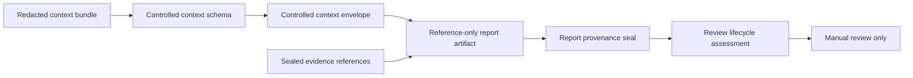

# Controlled Context and Deterministic Report Artifacts

## Purpose

This slice constrains existing redacted context bundles with a local schema and validates reference-only report artifacts. It enables a reviewer to see which context claims and sealed evidence a report cites without fetching content, constructing prompts, generating prose, signing, publishing, storing, or executing anything.



| Contract | Validates | Explicit boundary |
|---|---|---|
| Controlled context schema | Expected item kinds, reference prefixes, and required claim fields | Does not retrieve content, make a prompt, or call a model |
| Controlled context envelope | One claim per schema field, bundle binding, and content digest equality | Does not disclose raw artifact data |
| Deterministic review report | Report references resolve to known claims and sealed evidence | Does not generate engineering findings or prose |
| Report provenance seal | Report identifier, digest reference, trace reference, and sealer reference | Does not cryptographically sign or publish a report |
| Report lifecycle transition | Review-state order and provenance readiness | Does not save lifecycle state or authorize execution |

## Local validation

The canonical fixture in `examples/13-controlled-report/` binds the quadrotor review workflow to the existing redacted context and deterministic evidence fixtures.

```bash
PYTHONPATH=src mirage controlled-context-assess \
  examples/09-deterministic-workflow/workflow.json \
  examples/01-validate-eir/robot_model.yaml \
  examples/10-context-review/context.json \
  examples/13-controlled-report/context-schema.json \
  examples/13-controlled-report/context-envelope.json

PYTHONPATH=src mirage deterministic-report-assess \
  examples/09-deterministic-workflow/workflow.json \
  examples/01-validate-eir/robot_model.yaml \
  examples/10-context-review/context.json \
  examples/09-deterministic-workflow/evidence.json \
  examples/13-controlled-report/context-schema.json \
  examples/13-controlled-report/context-envelope.json \
  examples/12-governance-foundations/evidence-seals.json \
  examples/13-controlled-report/report.json
```

## Non-goals

The report is a schema-checked reference graph, not an engineering conclusion. This iteration does not implement controlled artifact retrieval, prompt assembly, model generation, report rendering, signature verification, persistence, publication, notification, external transport, sandbox enforcement, capability dispatch, simulator control, or hardware actuation.

> A report that is ready for review is still only a validated local artifact. It does not mean that a system has authenticated a reviewer, verified a physical measurement, or obtained permission to execute a workflow.
