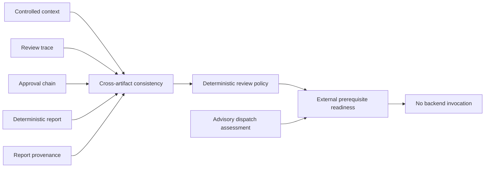

# Cross-Artifact Readiness

## Purpose

This integration slice verifies that independently validated review artifacts refer to the same workflow and satisfy a deterministic local review policy. It produces a single readiness view that preserves external denial reasons. It does not dispatch a capability, relax a policy, or treat review readiness as execution permission.



| Assessment | Success result | Boundary retained |
|---|---|---|
| Cross-artifact consistency | All review artifacts use one workflow identifier and are review-ready | Does not change any artifact or authorize an approval |
| Review policy | Report citation graph meets local section and reference constraints | Does not generate or judge engineering content |
| Workflow readiness | Local review is complete enough to enumerate external prerequisites | Does not dispatch, connect, or enable execution |

## Expected local result

The canonical fixture reports `ready_for_external_prerequisites`. This is intentionally different from a dispatch-ready state. The result retains denial reasons from the advisory dispatch assessment, including the missing independently verified live transport and enforced sandbox.

```bash
PYTHONPATH=src mirage workflow-readiness-assess \
  examples/09-deterministic-workflow/workflow.json \
  examples/01-validate-eir/robot_model.yaml \
  examples/10-context-review/context.json \
  examples/09-deterministic-workflow/evidence.json \
  examples/10-context-review/review-trace.json \
  examples/11-guarded-approval/approval-chain.json \
  examples/13-controlled-report/context-schema.json \
  examples/13-controlled-report/context-envelope.json \
  examples/12-governance-foundations/evidence-seals.json \
  examples/13-controlled-report/report.json \
  examples/13-controlled-report/report-seal.json \
  examples/14-cross-artifact-readiness/review-policy.json \
  examples/08-parallel-foundations/transport-manifest.json \
  examples/08-parallel-foundations/transport-evidence.json \
  examples/11-guarded-approval/sandbox-assessment.json
```

## External prerequisites that remain

The local repository now has a coherent review graph, but still lacks an authorized live read-only simulator transport and a real OS-enforced execution sandbox. A future readiness result must not be changed to execution permission until both independently verified prerequisites exist, together with durable authenticated approval and audited dispatch controls.
