# MIRAGE Delivery Status

## Current baseline

MIRAGE has completed the organization foundation, EIR validation, provider-neutral orchestration, and a bounded execution foundation. The local foundation now includes provenance-preserving JSON and YAML EIR candidate ingestion, deterministic transport manifests and evidence, sandbox enforcement-evidence contracts, a non-executing M4 goal-to-evaluate workflow review model, reference-only consistency checks across EIR, evidence, report declarations, report provenance seals, review traces, review-trace event declarations, and policy-provenance declarations, plus a versioned local ledger envelope with integrity inspection and bounded retention compaction. The full suite test count is refreshed during final verification.

```mermaid
flowchart LR
    M0[M0 organization and CI] --> M1[M1 EIR 0.1]
    M1 --> M2[M2 provider matrix]
    M2 --> M3[M3 bounded execution foundation]
    M3 --> T1[Verified real read-only transport]
    T1 --> T2[Enforced backend sandbox]
    T2 --> M4[M4 goal-to-evaluate workflow]
    M4 --> M5[M5 cross-simulator translation]
    M5 --> M6[M6 research reproduction]
    M6 --> M7[M7 hypothesis and optimization]
```

| Roadmap area | Status | Evidence in the repository |
|---|---|---|
| M0, organization and CI | Complete | Governance, contribution, security, CI, package boundaries, and CLI baseline |
| M1, EIR 0.1 | Complete | Pydantic schema, JSON Schema export, JSON/YAML validation, deterministic CLI, and controlled local candidate ingestion with source digests and diagnostics |
| M2, provider matrix | Complete with mocked contracts | Typed adapter protocol and six explicit provider adapters, optional live smoke harness |
| M3, bounded execution foundation | Partially complete | URCP, policy runtime, locally locked and digest-chained ledger with bounded retention, checkpoint revalidation, sandbox assessment, fixture-backed read-only adapter, transport evidence, and sandbox-evidence contracts |
| M4, goal-to-evaluate workflow | Foundation implemented | Bounded review-only goal, EIR-bound steps, criteria, policy-bound checkpoint, deterministic plan, evidence assessment, redacted context bundle, review trace, review-trace event consistency, policy-provenance consistency, approval chain, advisory eligibility, persistence interface, revocation review, provenance seal, lifecycle validation, controlled context, deterministic report artifact, cross-artifact consistency, reference-only provenance consistency, report-seal consistency, and readiness assessment; no planning model or execution pipeline |
| M5 through M7 | Planned | No implementation claim |

## What remains

The roadmap contains **eight milestone rows**. **Three are complete**, **two have active partial foundations**, and **three are planned major milestones**. A single percentage would be misleading because the remaining milestones have materially different scope and risk. The immediately actionable backlog has **six primary delivery streams**, followed by cross-cutting hardening work.

| Priority | Remaining delivery stream | Why it remains | Required evidence before completion |
|---|---|---|
| 1 | Verified real read-only simulator transport | The manifest and fixture evidence exist, but CoppeliaSim remains non-connecting and unavailable | Authorized endpoint, restricted client, authentication boundary, observed versions, timeout cleanup, independent fixture corpus, and adversarial tests |
| 2 | Enforced backend sandbox | Evidence contracts exist, but the local assessment is declarative and does not enforce OS-level limits | Auditable process, filesystem, network, CPU, memory, disk, and cleanup controls with adversarial tests |
| 3 | M4 goal-to-evaluate workflow | Review-only goal, EIR-bound steps, criteria, checkpoint, deterministic plan, evidence assessment, redacted context bundle, review trace, approval chain, advisory eligibility, persistence interface, revocation review, provenance seal, lifecycle validation, controlled context, deterministic report artifact, cross-artifact consistency, and readiness assessment exist, but no integrated engineering workflow exists | Controlled real context inputs, real evidence collection, policy-bound evaluation, authenticated approval persistence and transitions, rendered report artifacts, and integration tests |
| 4 | M5 cross-simulator translation | No verified semantic mapping exists between simulator backends | Adapter-specific mapping contracts, compatibility matrix, fixture and regression coverage |
| 5 | M6 research reproduction | No controlled research artifact ingestion or reproducibility workflow exists | Provenance model, isolated environments, artifact validation, retention, and review gates |
| 6 | M7 hypothesis and optimization | No autonomous hypothesis, experiment selection, diagnosis, or optimization runtime exists | Bounded objective model, safety policy, evidence provenance, evaluation, and human review controls |

Cross-cutting work remains on ESG concurrency and durable storage, ledger signatures or remote witnessing, stronger policy provenance, provider fallback and caching policy, isolated package-install verification, observability, and release governance. These are not substitutes for the six delivery streams above. They are foundations that must be delivered where their dependent milestones require them.

## Explicit boundaries

The fixture adapter does not establish real simulator connectivity. The declared sandbox does not establish operating-system isolation. Checkpoint revalidation does not resume work. The package artifacts are build-ready but unpublished. No statement in this guide authorizes simulator control, external side effects, physical actuation, package publication, or release automation.

## How to use this guide

Use this guide with [ROADMAP.md](../../ROADMAP.md) to choose the next vertical slice. Before claiming a stream complete, add its implementation, contract tests, safe examples, documentation, verification evidence, code review update, and workflow continuation context.
