# MIRAGE Delivery Status

## Current baseline

MIRAGE has completed the organization foundation, EIR validation, provider-neutral orchestration, and a bounded execution foundation. The current repository baseline contains 35 passing tests and supports deterministic EIR processing, typed provider contracts, revisioned ESG snapshots, policy-gated execution, append-only audit records, checkpoint revalidation, declarative sandbox assessment, and fixture-backed read-only simulator metadata and state extraction.

```mermaid
flowchart LR
    M0[M0 organization and CI] --> M1[M1 EIR 0.1]
    M1 --> M2[M2 provider matrix]
    M2 --> M3[M3 bounded execution foundation]
    M3 --> T1[Verified real read-only transport]
    T1 --> T2[Enforced backend sandbox]
    T2 --> M4[M4 goal-to-evaluate workflow]
    M4 --> M5[M5 cross-simulator translation]
    M5 --> M6[M6 research reproduction]
    M6 --> M7[M7 hypothesis and optimization]
```

| Roadmap area | Status | Evidence in the repository |
|---|---|---|
| M0, organization and CI | Complete | Governance, contribution, security, CI, package boundaries, and CLI baseline |
| M1, EIR 0.1 | Complete | Pydantic schema, JSON Schema export, JSON/YAML validation, deterministic CLI |
| M2, provider matrix | Complete with mocked contracts | Typed adapter protocol and six explicit provider adapters, optional live smoke harness |
| M3, bounded execution foundation | Partially complete | URCP, policy runtime, ledger, checkpoint revalidation, sandbox assessment, and fixture-backed read-only adapter |
| M4 through M7 | Planned | No implementation claim |

## What remains

The roadmap contains **eight milestone rows**. **Three are complete**, **one is an active partial foundation milestone**, and **four are planned major milestones**. A single percentage would be misleading because the remaining milestones have materially different scope and risk. The immediately actionable backlog has **six primary delivery streams**, followed by cross-cutting hardening work.

| Priority | Remaining delivery stream | Why it remains | Required evidence before completion |
|---|---|---|
| 1 | Verified real read-only simulator transport | The current adapter reads fixtures only; CoppeliaSim remains non-connecting and unavailable | Adapter-specific transport contract, authentication boundary, versioned state semantics, fixture corpus, timeout and cleanup tests |
| 2 | Enforced backend sandbox | Local assessment is declarative and does not enforce OS-level limits | Auditable process, filesystem, network, CPU, memory, disk, and cleanup controls with adversarial tests |
| 3 | M4 goal-to-evaluate workflow | No integrated goal, context, EIR, planning, simulation, evaluation, and report pipeline exists | Versioned workflow contract, human approvals, evidence flow, integration tests, and deterministic validation gates |
| 4 | M5 cross-simulator translation | No verified semantic mapping exists between simulator backends | Adapter-specific mapping contracts, compatibility matrix, fixture and regression coverage |
| 5 | M6 research reproduction | No controlled research artifact ingestion or reproducibility workflow exists | Provenance model, isolated environments, artifact validation, retention, and review gates |
| 6 | M7 hypothesis and optimization | No autonomous hypothesis, experiment selection, diagnosis, or optimization runtime exists | Bounded objective model, safety policy, evidence provenance, evaluation, and human review controls |

Cross-cutting work remains on ESG concurrency and durable storage, ledger locking and retention, stronger policy provenance, provider fallback and caching policy, isolated package-install verification, observability, and release governance. These are not substitutes for the six delivery streams above. They are foundations that must be delivered where their dependent milestones require them.

## Explicit boundaries

The fixture adapter does not establish real simulator connectivity. The declared sandbox does not establish operating-system isolation. Checkpoint revalidation does not resume work. The package artifacts are build-ready but unpublished. No statement in this guide authorizes simulator control, external side effects, physical actuation, package publication, or release automation.

## How to use this guide

Use this guide with [ROADMAP.md](../../ROADMAP.md) to choose the next vertical slice. Before claiming a stream complete, add its implementation, contract tests, safe examples, documentation, verification evidence, code review update, and workflow continuation context.
