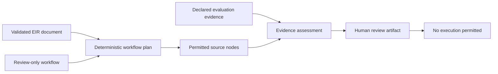

# Deterministic Workflow and Evidence Assessment

## Purpose

This slice advances the M4 workflow foundation without introducing a planning model, execution engine, simulator connection, or automatic resume path. It validates that a proposed workflow is tied to a validated EIR document and that every required evaluation criterion cites evidence from a source node included in that plan.



| Contract | Input | Result | Non-goal |
|---|---|---|---|
| `build_deterministic_plan()` | A `GoalToEvaluateWorkflow` and validated `EIRDocument` | A plan tied to the document ID, EIR version, and known source nodes | Model-generated planning or backend dispatch |
| `assess_evaluation_evidence()` | A deterministic plan and declared evidence | Criterion coverage, source-node checks, and review readiness | Engineering correctness judgment, metric execution, or report generation |
| `goal-workflow-plan` | Local workflow JSON and local EIR JSON or YAML | A review-only plan artifact | Simulator, provider, or network access |
| `goal-workflow-evidence` | Local workflow, EIR, and evidence JSON | A review-only evidence assessment | Automatic approval or execution |

## Deterministic planning boundary

Every `GoalWorkflowStep` must cite at least one EIR node identifier. `build_deterministic_plan()` first revalidates the supplied EIR document, then checks that the workflow's declared document ID matches the actual EIR document and that every cited node exists. It returns `invalid` rather than guessing or repairing a missing reference.

The plan can become `ready_for_review`, but its `execution_permitted` field is fixed to `false`. Readiness only means that document references are consistent and suitable for a human review step.

```bash
PYTHONPATH=src mirage goal-workflow-plan \
  examples/09-deterministic-workflow/workflow.json \
  examples/01-validate-eir/robot_model.yaml
```

## Evidence assessment boundary

Evidence items bind one evaluation criterion to one or more source nodes and a reference string. The assessor rejects evidence that names an unknown criterion or cites a node outside the plan. It reports missing required criterion evidence as `insufficient` and invalid source or plan conditions as `invalid`.

```bash
PYTHONPATH=src mirage goal-workflow-evidence \
  examples/09-deterministic-workflow/workflow.json \
  examples/01-validate-eir/robot_model.yaml \
  examples/09-deterministic-workflow/evidence.json
```

> A ready evidence assessment means that declared citations cover the requested review criteria. It does not prove that a design is physically correct, that a simulation has run, or that an experiment should be authorized.

## Verification-integrity requirements

Live transport and sandbox verification remain unavailable by default. The contract now makes their required evidence more explicit.

| Claim | Required integrity fields | Current repository status |
|---|---|---|
| Live read-only transport verification | Authorization reference, observed simulator version, independent verifier, operation transcript digest, and cleanup verification | No live evidence exists; CoppeliaSim remains unverified and non-connecting |
| Verified OS sandbox evidence | Evidence digest, environment fingerprint, verifier, and non-empty verified control set | No real isolated backend exists; local assessment remains declarative |

These fields protect against an unreviewed status change from fixture evidence to a live or OS-enforced claim. The project still requires an authorized environment and observed control behavior before it can represent either claim as verified.

## Next steps

The deterministic M4 work now needs controlled context inputs, evidence schemas for real measurements and simulator snapshots, evaluation logic under explicit policy, audited approval transitions, and report artifacts. These must follow real read-only transport and OS-enforced sandbox verification. Simulator control, external side effects, physical actuation, automatic checkpoint resume, and autonomous experiment selection remain outside this slice.
