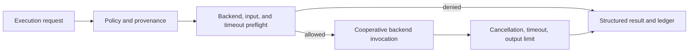

# Execution Hardening Guide

## Purpose

This guide describes MIRAGE controls that constrain a declared URCP capability before and during execution. The controls apply to the deterministic execution layer, not to arbitrary host commands, simulator control, external side effects, or physical actuation.

## Enforcement sequence



| Control | When it applies | Current behavior |
|---|---|---|
| Policy provenance | Every result | Records policy ID, revision, source, and optional approver in result metadata |
| Backend allow-list | Before dispatch | Denies a backend outside the explicit policy set |
| Input budget | Before dispatch | Denies a JSON-serializable input payload over the configured byte limit |
| Timeout budget | Before dispatch and during execution | Denies an excessive request timeout or returns `timed_out` after expiry |
| Cancellation token | Before and during execution | Returns `cancelled` without attempting further backend work where cooperation is possible |
| Output budget | After invocation | Returns `failed` when a backend output exceeds the configured byte limit |

## Policy provenance

Every `ExecutionPolicy` carries a `PolicyProvenance` record. The default local policy is not evidence of human approval. A future policy service may provide a signed or centrally managed provenance record, but current MIRAGE behavior remains local and explicit.

## Cancellation and timeout

`CancellationToken` is intentionally non-serializable and is passed separately from `ExecutionRequest`. This prevents serialized workflow input from becoming an executable cancellation instruction. Backends cooperate by checking the token or awaiting cancellation. MIRAGE cancels pending tasks at timeout, but a future production backend still needs OS or container resource isolation for non-cooperative work.

## Resource limits

`ResourceLimits` currently enforce request timeout, input size, and output size. CPU, memory, network, disk, GPU, and process limits require a verified backend sandbox and are not yet claimed.

## Simulator inspection boundary

`simulator-inspect` exposes only an inspection contract. The CoppeliaSim boundary returns an explicit `unavailable` status, records whether an endpoint was supplied, and never opens a connection, reads state, starts a simulation, writes an artifact, or sends a control command. This is a safe preparation point for a later verified state-extraction adapter.

```bash
mirage simulator-inspect
mirage execute run_simulation --allow-simulation --timeout-seconds 1
```

## Current limitations

The local simulation backend is deterministic test infrastructure. It is not sandboxed. CoppeliaSim remains unverified and unavailable. There is no simulator state extraction, simulator control, experiment scheduler, external side effect adapter, or physical actuation path.
