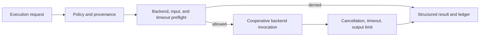

# Execution Hardening Guide

## Purpose

This guide describes MIRAGE controls that constrain a declared URCP capability before and during execution. The controls apply to the deterministic execution layer, not to arbitrary host commands, simulator control, external side effects, or physical actuation.

## Enforcement sequence



| Control | When it applies | Current behavior |
|---|---|---|
| Policy provenance | Every result | Records policy ID, revision, source, and optional approver in result metadata |
| Backend allow-list | Before dispatch | Denies a backend outside the explicit policy set |
| Input budget | Before dispatch | Denies a JSON-serializable input payload over the configured byte limit |
| Timeout budget | Before dispatch and during execution | Denies an excessive request timeout or returns `timed_out` after expiry |
| Cancellation token | Before and during execution | Returns `cancelled` without attempting further backend work where cooperation is possible |
| Output budget | After invocation | Returns `failed` when a backend output exceeds the configured byte limit |

## Policy provenance

Every `ExecutionPolicy` carries a `PolicyProvenance` record. The default local policy is not evidence of human approval. A future policy service may provide a signed or centrally managed provenance record, but current MIRAGE behavior remains local and explicit.

## Cancellation and timeout

`CancellationToken` is intentionally non-serializable and is passed separately from `ExecutionRequest`. This prevents serialized workflow input from becoming an executable cancellation instruction. Backends cooperate by checking the token or awaiting cancellation. MIRAGE cancels pending tasks at timeout, but a future production backend still needs OS or container resource isolation for non-cooperative work.

## Resource limits

`ResourceLimits` currently enforce request timeout, input size, and output size. CPU, memory, network, disk, GPU, and process limits require a verified backend sandbox and are not yet claimed.

## Read-only simulator extraction boundary

`simulator-metadata` reads a deterministic fixture through the `FixtureSimulatorAdapter`. It returns typed project metadata and an optional bounded state snapshot. Each result includes a policy-derived sandbox assessment, reports `control_available: false`, and is isolated from real simulator transport. A request may be denied before reading when the policy disables read-only access, denies the selected backend, exceeds the timeout budget, requests an unsupported sandbox envelope, or would exceed the output budget.

The adapter uses a `CancellationToken` during its cooperative timeout path. A timeout returns `timed_out`, cancels the supplied token with a reason, and does not attempt a follow-on action. This is cooperative task cancellation, not operating-system process enforcement.

The `CoppeliaSimReadOnlyAdapter` intentionally returns `unavailable`. It records whether an endpoint was supplied, labels its transport as unverified, and never opens a connection, reads real state, starts or stops a simulation, steps a simulator, writes an artifact, sends a control command, or actuates physical hardware.

```bash
mirage simulator-inspect
mirage simulator-metadata examples/07-simulator-adapter/fixture-simulation.json --include-state
```

## Current limitations

The fixture adapter is deterministic test infrastructure. It is not a real simulator connection and it is not OS sandboxed. CoppeliaSim remains unverified and unavailable. There is no simulator control, experiment scheduler, external side effect adapter, or physical actuation path.
