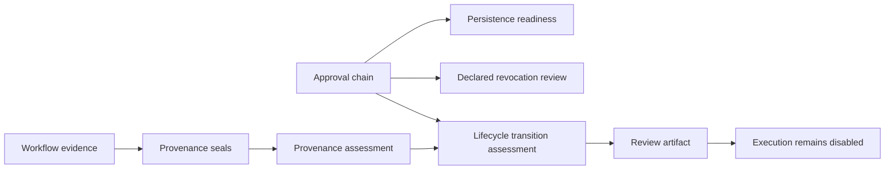

# Governance Foundations

## Purpose

This iteration completes the next local governance layer for the M4 review workflow. It introduces contracts for future authenticated approval persistence, declared approval revocation, evidence provenance seals, and workflow lifecycle transition validation. Each operation parses and compares supplied local data only. None writes a record, resolves a credential, retrieves evidence, changes lifecycle state, or authorizes execution.



| Contract | Validates | Explicit boundary |
|---|---|---|
| Approval persistence descriptor | Identity reference, audit reference, signature scheme, retention, and declared integrity fields | Does not use a credential, authenticate a user, verify a signature, or write a record |
| Approval revocation record | Chain, approval identifier, policy provenance, reason, digest, and timestamp | Does not revoke a stored approval or notify an external system |
| Evidence provenance seal | Evidence identifier, source reference, digest, capture method, timestamp, and verifier reference | Does not retrieve, inspect, or physically validate evidence contents |
| Lifecycle transition | Declared review-state ordering plus approval and provenance readiness | Does not mutate workflow state or enable dispatch |

## Approval integration readiness

`ApprovalPersistenceDescriptor` is a future adapter contract. It deliberately uses `credential_reference` rather than secret material and exposes a protocol with metadata and assessment methods only. The current `assess_approval_persistence()` result means that a descriptor is structurally ready for a future integration review. It is not proof that an external audit service, identity provider, signature implementation, or durable database exists.

```bash
PYTHONPATH=src mirage approval-persistence-assess \
  examples/09-deterministic-workflow/workflow.json \
  examples/01-validate-eir/robot_model.yaml \
  examples/10-context-review/context.json \
  examples/09-deterministic-workflow/evidence.json \
  examples/10-context-review/review-trace.json \
  examples/11-guarded-approval/approval-chain.json \
  examples/12-governance-foundations/persistence.json
```

## Revocation and provenance review

Revocation is intentionally a declared review event. A valid `declared` result only proves that a record refers to an approval in the local chain and matches the active policy provenance. A production revocation workflow will need identity authorization, durable append-only storage, cryptographic signature verification, notification, and immediate revalidation by any future dispatcher.

Evidence provenance seals form a one-to-one mapping between local evidence declarations and seal records. Every evidence item must have a matching seal and source reference. This identifies absent or mismatched provenance metadata without treating a digest as proof of physical or experimental correctness.

```bash
PYTHONPATH=src mirage approval-revocation-assess \
  examples/09-deterministic-workflow/workflow.json \
  examples/01-validate-eir/robot_model.yaml \
  examples/10-context-review/context.json \
  examples/09-deterministic-workflow/evidence.json \
  examples/10-context-review/review-trace.json \
  examples/11-guarded-approval/approval-chain.json \
  examples/12-governance-foundations/revocation.json

PYTHONPATH=src mirage evidence-provenance-assess \
  examples/09-deterministic-workflow/workflow.json \
  examples/01-validate-eir/robot_model.yaml \
  examples/09-deterministic-workflow/evidence.json \
  examples/12-governance-foundations/evidence-seals.json
```

## Lifecycle review

The valid lifecycle order is `draft` to `review_ready`, then `approval_reviewed`, then `eligibility_assessed`. `assess_lifecycle_transition()` checks this declared ordering against approval and evidence-provenance artifacts. It never saves a new state or makes a future dispatch eligible.

> A valid lifecycle transition is an inspectable consistency result. It is not an authorization, a state change, or evidence that real transport and sandbox prerequisites have been met.

## Non-goals

This slice does not implement OAuth, credential storage, databases, signatures, notification delivery, external audit logs, webhooks, live evidence collection, simulator transport, process isolation, task dispatch, simulator control, hardware actuation, or autonomous workflow execution.
