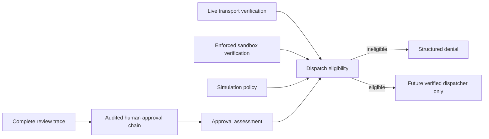

# Guarded Approval and Dispatch Eligibility

## Purpose

This slice adds an auditable review checkpoint after context, plan, evidence, and trace validation. It distinguishes an internally consistent human approval record from the separate technical prerequisites for a future dispatch. Approval therefore remains a review artifact. It cannot authorize execution by itself.



| Contract | Validates | Result | Boundary |
|---|---|---|---|
| `ApprovalChain` | Approval record identity, workflow and trace identity, digest linkage, policy provenance, and latest decision | `review_ready`, `rejected`, or `invalid` | It does not alter workflow state, create authority, or execute work |
| `DispatchEligibilityAssessment` | Approval readiness, active simulation policy, live transport verification, and enforced sandbox assessment | `ineligible` or `eligible_for_verified_dispatch` | It never invokes a backend and always returns `execution_permitted: false` |

## Audited approval chains

Each `HumanApprovalRecord` binds a human identifier, decision, workflow, trace, policy provenance, digest, prior digest, and recorded timestamp. The chain validates ordered digest linkage and rejects mismatched workflow or trace identifiers. A rejected latest decision remains rejected.

```bash
PYTHONPATH=src mirage approval-chain-assess \
  examples/09-deterministic-workflow/workflow.json \
  examples/01-validate-eir/robot_model.yaml \
  examples/10-context-review/context.json \
  examples/09-deterministic-workflow/evidence.json \
  examples/10-context-review/review-trace.json \
  examples/11-guarded-approval/approval-chain.json
```

The command assesses supplied local data. It does not create, sign, store, or notify a human approval. A production approval system still needs authenticated identities, immutable storage, signature verification, retention, revocation, and an external audit boundary.

## Dispatch eligibility

`assess_dispatch_eligibility()` evaluates four prerequisites together. It requires a `review_ready` approval chain, a policy that permits simulation, a valid `live_verified` transport assessment, and an `allowed` sandbox assessment backed by verified enforcement evidence. Any missing condition produces `ineligible` with a specific reason.

```bash
PYTHONPATH=src mirage dispatch-eligibility-assess \
  examples/09-deterministic-workflow/workflow.json \
  examples/01-validate-eir/robot_model.yaml \
  examples/10-context-review/context.json \
  examples/09-deterministic-workflow/evidence.json \
  examples/10-context-review/review-trace.json \
  examples/11-guarded-approval/approval-chain.json \
  examples/08-parallel-foundations/transport-manifest.json \
  examples/08-parallel-foundations/transport-evidence.json \
  examples/11-guarded-approval/sandbox-assessment.json \
  --allow-simulation
```

The example deliberately reports `ineligible` and exits with status 1. Its transport evidence is fixture-only, and its sandbox result is declarative only. The command does not try to compensate for the missing prerequisites by opening a simulator connection or dispatching a task.

> `eligible_for_verified_dispatch` is an advisory preflight result, not a dispatch authorization. A future dispatcher must independently revalidate all evidence immediately before it performs any action.

## Explicit non-goals

This iteration does not implement identity verification, signatures, storage, notifications, approval mutation, revocation, a dispatcher, a simulator client, a sandbox runtime, automatic workflow resume, external side effects, or hardware control. It turns missing prerequisites into structured denial rather than an attempt to execute.
