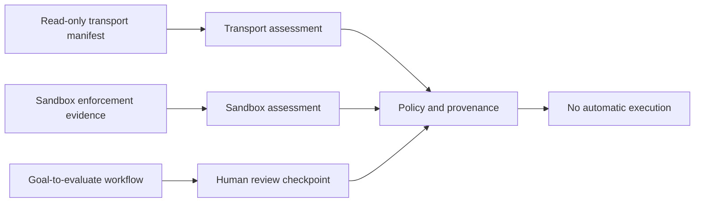

# Parallel Foundation Contracts

## Purpose

MIRAGE now contains three independently testable foundations developed as a combined safety slice: a read-only transport manifest and evidence contract, an enforcement-evidence contract for sandbox assessment, and a non-executing goal-to-evaluate workflow review model. They share policy provenance, explicit capability requirements, cancellation-aware boundaries, and a prohibition on simulator control.



| Track | Implemented contract | What it does not establish |
|---|---|---|
| Transport verification | Versioned allowed read operations, prohibited control operations, and deterministic fixture evidence | A real CoppeliaSim connection, authentication boundary, live-state semantics, or simulator control |
| Sandbox evidence | Required evidence for a backend to claim a requested OS-enforced envelope | A host-level sandbox in the local backend or proof that test evidence enforces an operating-system control |
| M4 workflow foundation | Versioned goal, bounded review steps, evaluation criteria, policy-bound checkpoint, and manual revalidation | Provider planning, automatic resume, simulation execution, evidence collection, reporting, or autonomous experimentation |

## Read-only transport verification

`ReadOnlyTransportManifest` declares a transport's adapter identity, protocol, endpoint scheme, simulator and state-semantics revisions, allowed reads, and prohibited operations. A manifest must prohibit scene loading, simulation start, pause, stop, stepping, reset, object mutation, scene writing, and physical actuation.

The CoppeliaSim reference manifest uses the ZeroMQ Remote API vocabulary but remains **unverified** and non-connecting. CoppeliaSim documents that its ZeroMQ Remote API exposes the simulator's broad API surface, including simulation control. MIRAGE therefore cannot treat that remote API as read-only merely because the requested calls are reads. A future adapter must prove a restricted operation allow-list, a transport authentication boundary, observed version semantics, fixture coverage, timeout cleanup, and independent safety review before it may report a live verification state. [1]

The position API itself illustrates the bounded data shape, returning three position values in a declared reference frame. MIRAGE still requires its own versioned snapshot semantics, rather than inferring complete state safety from any individual API call. [2]

```bash
PYTHONPATH=src mirage transport-assess \
  examples/08-parallel-foundations/transport-manifest.json \
  examples/08-parallel-foundations/transport-evidence.json
```

This command parses local JSON only. It never opens a network socket or invokes a simulator API.

## Sandbox enforcement evidence

`SandboxEnforcementEvidence` makes an enforcement claim auditable. A backend that requests CPU, memory, disk, process, network, allow-list, filesystem, or subprocess controls must first declare matching capabilities and provide verified evidence for every requested control. Without both capability claims and matching evidence, `assess_sandbox()` returns `denied` for an OS-enforced envelope.

> The evidence model prevents a capability declaration from being mistaken for proof of operating-system isolation. It is a contract foundation, not an implementation of cgroups, containers, mount namespaces, firewall rules, or process supervision.

The local backend remains declarative only under its default envelope. The test-only evidence-backed backend demonstrates the acceptance condition in a deterministic contract test; it does not turn the local process into a real isolated runtime.

## Goal-to-evaluate workflow review

`GoalToEvaluateWorkflow` contains an engineering goal, EIR document identifier, up to eight proposed steps, and up to eight evaluation criteria. Every step names an exact URCP capability and backend requirement, expected evidence, and a human-approval requirement. `review()` creates a `WorkflowCheckpoint` at `awaiting-human-review` and calls the existing non-executing checkpoint revalidation path.

```bash
PYTHONPATH=src mirage goal-workflow-review \
  examples/08-parallel-foundations/goal-workflow.json \
  --backend fixture
```

The output is a review artifact. `execution_permitted` is always `false`, the checkpoint does not resume work, and no model, backend, simulator, or physical system is invoked.

## Current limitations and next evidence

The live read-only CoppeliaSim transport and OS-enforced sandbox remain incomplete. The next transport increment needs a verified external endpoint in an authorized test environment, explicit credentials handling, a restricted read-only client, protocol version pinning, connection timeout and cleanup behavior, an independent fixture corpus, and adversarial tests. The next sandbox increment needs a real isolated backend that can generate evidence from observed controls rather than static test models.

M4 also remains incomplete. Its next increments are deterministic EIR-to-plan validation, explicit context inputs, evidence collection and evaluation contracts, human approval transitions, and an audited report artifact. None of those increments should introduce autonomous execution before the transport and sandbox prerequisites are independently verified.

## References

[1]: https://manual.coppeliarobotics.com/en/zmqRemoteApiOverview.htm "CoppeliaSim ZeroMQ Remote API"
[2]: https://manual.coppeliarobotics.com/en/sim/simGetObjectPosition.htm "CoppeliaSim sim.getObjectPosition"
