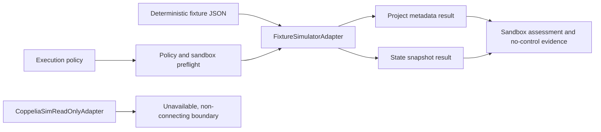

# Read-Only Simulator Adapter

## Purpose

MIRAGE can inspect deterministic fixture data through a narrow read-only simulator adapter contract. The slice provides typed project metadata and bounded state snapshots without any simulator control capability. It supports engineering review of state-extraction semantics before MIRAGE accepts a real simulator transport.



## Contract

| Type | Role | Important guarantees |
|---|---|---|
| `SimulatorProjectMetadata` | Identifies a project, scene, simulator version, and object counts | Contains no execution request or control field |
| `SimulatorStateSnapshot` | Captures bounded object pose and velocity observations in a named world frame | Does not step, reset, start, or stop a simulator |
| `ReadOnlySimulatorAdapter` | Defines `read_project_metadata()` and `read_state_snapshot()` | Omits write, command, connection-management, and simulator-control operations |
| `ReadOnlySimulatorResult` | Returns status, data, observations, and sandbox evidence | Always sets `control_available` to `false` |

The new `inspect_simulator_state@0.1` URCP descriptor is classified as `read_only`. Its fixture backend is deterministic. The descriptor does not convert an unavailable transport into a simulator-control capability.

## Supported backend

`FixtureSimulatorAdapter` loads structured JSON from a local path and returns deep copies of the validated values. It performs no network I/O, subprocess invocation, or simulator connection. The example fixture is located at `examples/07-simulator-adapter/fixture-simulation.json`.

```bash
PYTHONPATH=src mirage simulator-metadata examples/07-simulator-adapter/fixture-simulation.json --include-state
```

The output contains separate metadata and snapshot results. Each result includes the declared sandbox assessment. Under the default local policy the assessment is `declarative_only`, which correctly means no operating-system isolation has been claimed.

## Policy, timeout, and cancellation

The adapter accepts `ExecutionPolicy`, an optional timeout, and an optional `CancellationToken`. It rejects read-only access if the policy disables it, rejects a backend outside the policy allow-list, rejects timeout requests above a policy limit, and rejects a response that exceeds the policy output budget. If the selected sandbox envelope requires enforcement unavailable from the backend, it returns `denied` before the source is read.

If a read exceeds its effective timeout, MIRAGE cancels the associated cooperative token and returns `timed_out`. If a caller cancels a token first, the adapter returns `cancelled`. These controls manage the in-process task only. They do not impose cgroups, containers, resource quotas, or kernel-level network controls.

## Unavailable CoppeliaSim boundary

`CoppeliaSimReadOnlyAdapter` has no transport implementation. It returns `unavailable` for both project metadata and state snapshot requests. Providing an endpoint only causes the result to record `endpoint_configured: true`; it does not create a socket or initiate a connection.

> The unavailable boundary is intentional. Until a transport, versioned state semantics, fixture corpus, and adapter-specific safety review are verified, MIRAGE must not claim live CoppeliaSim state extraction.

## Non-goals

This iteration does not start, stop, pause, reset, or step a simulator. It does not change scene state, load scenes, upload files, persist artifacts, run experiments, call arbitrary tools, execute host commands, reach a network service, or control hardware. Simulator control remains a separately gated future capability.

## Verification

`tests/test_simulator_adapter.py` covers deterministic fixture extraction, policy and backend denial, unsupported sandbox denial, cooperative timeout cancellation, unavailable CoppeliaSim behavior, and the CLI fixture path. Run the focused suite with:

```bash
python -m pytest -q tests/test_simulator_adapter.py
```
