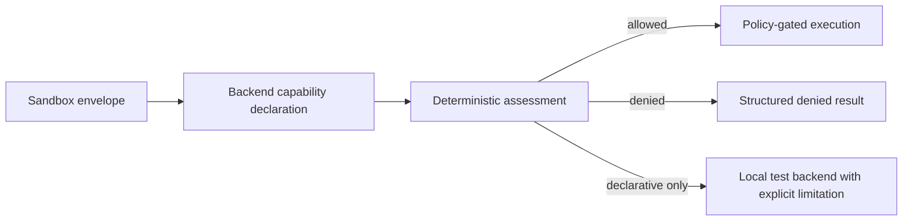

# Sandbox Envelope and Checkpoint Revalidation

## Purpose

MIRAGE now evaluates declared backend sandbox requirements before execution and revalidates checkpoints before any future manual resume review. These features prevent a backend from silently accepting restrictions it cannot enforce, and prevent stale checkpoint assumptions from becoming executable work.

## Sandbox envelope

`SandboxEnvelope` declares restrictions for CPU, memory, disk, process count, network transfer, network host allow-lists, filesystem mode, and subprocess use. `BackendSandboxCapabilities` states what a backend can actually enforce. `assess_sandbox` returns one of three outcomes.

| Status | Meaning | Runtime behavior |
|---|---|---|
| `allowed` | The backend reports support for every requested restriction | The executor may proceed after normal policy checks |
| `denied` | The envelope requests an operating-system-level restriction that the backend cannot enforce | The executor returns a structured denial before backend invocation |
| `declarative_only` | The envelope has no enforceable OS resource request, or the local backend cannot prove isolation | The local deterministic backend may proceed, but result metadata records the limitation |



The local backend does not claim CPU, memory, disk, process, network, filesystem, or subprocess isolation. A requested memory limit, for example, is denied instead of being silently ignored.

```bash
mirage sandbox-assess
mirage sandbox-assess --max-memory-mb 256
```

## Checkpoint revalidation

`WorkflowCheckpoint.revalidate()` examines the active capability registry and policy before a checkpoint can move into a future human-approved resume flow. It returns a typed result and never invokes a backend, updates a checkpoint, starts a task, or resumes work.

The revalidation result checks the following facts:

| Check | Failure code |
|---|---|
| Stored policy provenance matches active policy provenance | `policy_provenance_mismatch` |
| Required capability and exact version still exist | `capability_missing` |
| Active policy permits each required capability | `capability_denied` |
| Active backend allow-list permits each required backend | `backend_denied` |

```bash
mirage checkpoint-revalidate examples/06-sandbox-checkpoint/review-checkpoint.json
```

## Boundary

This iteration provides deterministic validation, not process isolation or resume automation. A production sandbox needs verified process supervision, cgroups or equivalent resource enforcement, filesystem mounts, network controls, command allow-lists, cleanup, and security review. Checkpoint revalidation is a prerequisite for manual review, not permission to execute.
